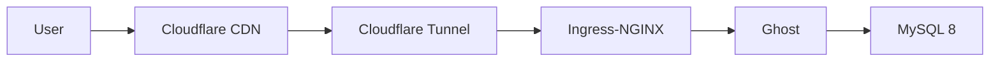

- Spent six months debugging sitemap registration. The cause was the free subdomain.
- Built a k8s cluster to run a single blog.
- Got recommended Astro from the start, picked Ghost instead, came back a year and a half later.

---

I started a Hugo blog around 2024. Hosted it on GitHub Pages, wrote some posts, everything worked — except Google Search Console wouldn't accept my sitemap. `Sitemap: couldn't fetch`. That error stuck around for six months.

I assumed it was a Hugo config issue at first. Checked `enableRobotsTXT = true`, ran the sitemap through XML validators. It passed, but looking at the actual content I found `favicon.ico` listed as a URL, inline SVG data URIs sneaking in. Fixed those one by one.

Went deeper into the network layer. The HTTP response for sitemap.xml was coming back `304 Not Modified` — should have been 200. The `Content-Type` header was missing entirely, when it should have been `application/xml`. GitHub Pages does some internal Jekyll processing that might have been interfering, so I added a `.nojekyll` file. Didn't help.

Moved to Cloudflare Pages. Deployed to `sungho-park-gigio.pages.dev` without issues, but GSC sitemap registration still failed. At this point I couldn't tell if Hugo was the problem or the hosting was.

I decided to run a control experiment. Set up a Jekyll blog under the same conditions and tested. The Ruby environment setup on macOS was its own ordeal — `gem install jekyll bundler` throws `Gem::FilePermissionError` because of system Ruby permissions. Installed rbenv, still pointed to system Ruby. Forgot to add `eval "$(rbenv init - zsh)"` to `.zshrc`. These things eat time.

Got Jekyll deployed to Cloudflare Pages and registered with GSC. Same failure. That confirmed it wasn't the framework. Most likely the free subdomain itself (`.github.io`, `.pages.dev`) was the issue.

## A $10 domain

Decided to buy a custom domain. Compared a few registrars — Cloudflare Registrar does at-cost pricing, zero margin. `.com` was $10.46/year with the same renewal rate. WHOIS handling is registry-level redaction, no separate proxy service needed. The downside is DNS locked to Cloudflare, but I was already using Cloudflare Pages so it didn't matter.

Bought `sungho-gigio.com` and connected it. Still failed at first. I'd registered it as a "URL Prefix" property in GSC. Switched to "Domain" property, verified ownership via Cloudflare DNS TXT record, and it worked immediately. Six months of suspecting sitemap XML format, inspecting HTTP headers, and switching frameworks — all unnecessary. One property type change.

## Why I picked Ghost

With the sitemap resolved, Hugo's design felt bare, so I started looking at alternatives. Asked ChatGPT for a comparison — Astro came out on top. Zero JS by default, Islands Architecture, Content Collections. Right tool for the job.

I picked Ghost instead. The WYSIWYG editor was appealing — Markdown cards, images, math formulas with instant preview. SEO was fully built-in, no build config to manage. And I already had a free Oracle Cloud ARM64 instance sitting idle (4 OCPU, 24GB RAM). Had a server, figured I'd use it.

## k8s for a blog

Deciding to self-host Ghost made things escalate.

Set up k3s on the Oracle Cloud ARM64 instance, configured GitOps with Argo CD using the App-of-Apps pattern and Kustomize overlays for staging/prod. Secrets went into HashiCorp Vault with VSO for K8s injection, and bootstrap secrets were encrypted with SOPS (age encryption), auto-decrypted via a ksops sidecar on the Argo CD repo-server.

Exposed everything through Cloudflare Tunnel (replica 2), protected the Ghost admin at `/ghost/*` with Zero Trust Access. Monitoring was Prometheus + Grafana + Loki + Blackbox Exporter, plus Uptime Kuma.

Learned the hard way that Ghost behind Ingress-NGINX needs the `X-Forwarded-Proto: https` header, otherwise you get an infinite redirect loop. Cloudflare Tunnel terminates HTTPS and forwards HTTP to the backend — Ghost sees an HTTP connection and redirects to HTTPS, which loops back.

Issues kept coming during operation. Ghost container throwing `bcryptjs` MODULE_NOT_FOUND because Node's eval context couldn't resolve the module path. npm failing with `ENOTEMPTY` from leftover temp directories of interrupted installs. Spam signups from disposable email domains, which I had to block by maintaining a domain list in `config.production.json`.

All of this to run one blog. The learning was worth it, but I was getting further from actually writing. One thing I confirmed: Cloudflare's free tier is generous. Tunnel, Zero Trust (50 users), DNS, Access (Google/GitHub IdP), Universal SSL, Email Routing — all free.

## The writer changed

Ghost's WYSIWYG editor is built for humans writing in a browser. Starting late 2025, I was spending more time with tools like Claude Code, and the workflow shifted — agents needed to read and write Markdown files directly. Ghost's Admin API doesn't really support that.

I'd picked Ghost for the "writing experience," but the one doing the writing shifted from me to AI, and that criterion stopped mattering. WYSIWYG is great when a human is typing.

Went back to Astro — the thing I was recommended in the first place. Markdown file-based, so agents work with it freely. Static site, no k8s needed. Back during the Hugo era I deployed to Cloudflare Pages (static hosting only), but Cloudflare has since unified Pages and Workers into Cloudflare Workers & Pages. That's where it runs now.

| Detour | What I got |
|--------|-----------|
| 6 months of sitemap debugging | GSC Domain vs URL Prefix property, HTTP header analysis, isolating causes through control experiments |
| Domain purchase research | Registrar ecosystem, at-cost pricing, WHOIS redaction vs proxy |
| Ghost on k8s | Hands-on k3s, Argo CD, Kustomize, Vault + SOPS, Cloudflare Tunnel, monitoring stack |
| Ghost → Astro | "Who is the user of the tool?" |

If I'd bought a $10 domain and used Astro from the start, none of this would have happened. Then again, this post wouldn't exist either.
