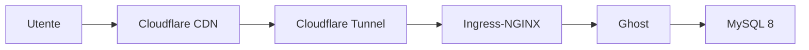

- Ho passato sei mesi a fare debug della registrazione sitemap. La causa era il sottodominio gratuito.
- Ho costruito un cluster k8s per gestire un singolo blog.
- Mi avevano consigliato Astro fin dall'inizio, ho scelto Ghost, e ci sono tornato un anno e mezzo dopo.

---

Ho creato un blog con Hugo intorno al 2024. Lo hostavo su GitHub Pages, scrivevo qualche post, tutto funzionava — tranne una cosa. Google Search Console non accettava la sitemap. `Sitemap: couldn't fetch`. Quell'errore è rimasto per sei mesi.

All'inizio pensavo fosse un problema di configurazione Hugo. Ho verificato `enableRobotsTXT = true`, ho passato la sitemap attraverso validatori XML. Passava, ma guardando il contenuto ho trovato `favicon.ico` come URL, data URI SVG inline che si infilavano dentro. Ho corretto tutto uno alla volta.

Sono sceso al livello di rete. La risposta HTTP per sitemap.xml tornava `304 Not Modified` — doveva essere 200. L'header `Content-Type` mancava del tutto, quando avrebbe dovuto essere `application/xml`. GitHub Pages fa un'elaborazione Jekyll interna che poteva interferire, così ho aggiunto un file `.nojekyll`. Non ha funzionato.

Mi sono spostato su Cloudflare Pages. Il deploy su `sungho-park-gigio.pages.dev` è andato bene, ma la registrazione sitemap su GSC continuava a fallire. A quel punto non capivo se il problema era Hugo o l'hosting.

Ho deciso di fare un esperimento di controllo. Ho creato un blog Jekyll nelle stesse condizioni. Configurare l'ambiente Ruby su macOS è stata un'avventura a sé — `gem install jekyll bundler` lancia `Gem::FilePermissionError` per via dei permessi del Ruby di sistema. Ho installato rbenv, ma continuava a puntare al Ruby di sistema. Avevo dimenticato `eval "$(rbenv init - zsh)"` nel `.zshrc`. Queste cose mangiano tempo.

Ho deployato il blog Jekyll su Cloudflare Pages e registrato su GSC. Stesso fallimento. Confermato: non era il framework. Il problema era probabilmente il sottodominio gratuito (`.github.io`, `.pages.dev`).

## Un dominio da $10

Ho deciso di comprare un dominio personalizzato. Ho confrontato qualche registrar — Cloudflare Registrar ha prezzi at-cost, zero margine. `.com` a $10.46/anno con lo stesso prezzo al rinnovo. Il WHOIS è gestito con redaction a livello di registro, nessun servizio proxy separato. Lo svantaggio è il DNS bloccato su Cloudflare, ma stavo già usando Cloudflare Pages quindi non importava.

Ho comprato `sungho-gigio.com` e l'ho collegato. Non ha funzionato subito neanche così. Avevo registrato il sito come "URL Prefix" property in GSC. Ho cambiato in "Domain" property, verificato la proprietà con un record TXT nel DNS di Cloudflare, e ha funzionato immediatamente. Sei mesi a sospettare del formato XML della sitemap, ispezionare header HTTP, cambiare framework — tutto inutile. Bastava cambiare un tipo di property.

## Perché ho scelto Ghost

Con la sitemap risolta, il design del blog Hugo mi sembrava scarno, così ho iniziato a valutare alternative. Ho chiesto un confronto a ChatGPT — Astro è uscito primo. Zero JS di default, Islands Architecture, Content Collections. Lo strumento giusto.

Ho scelto Ghost. L'editor WYSIWYG mi attirava — card Markdown, immagini, formule con anteprima istantanea. Il SEO era completamente integrato, nessuna configurazione di build da gestire. E avevo già un'istanza ARM64 gratuita su Oracle Cloud (4 OCPU, 24GB RAM) inutilizzata. Avevo un server, tanto valeva usarlo.

## k8s per un blog

Decidere di self-hostare Ghost ha fatto escalare le cose.

Ho installato k3s sull'istanza ARM64 di Oracle Cloud, configurato GitOps con Argo CD usando il pattern App-of-Apps e overlay Kustomize per staging/prod. I secret in HashiCorp Vault con VSO per l'iniezione in K8s, i secret di bootstrap criptati con SOPS (crittografia age), decriptati automaticamente da un sidecar ksops sul repo-server di Argo CD.

Esposto tutto con Cloudflare Tunnel (replica 2), protetto l'admin Ghost su `/ghost/*` con Zero Trust Access. Monitoraggio con Prometheus + Grafana + Loki + Blackbox Exporter, più Uptime Kuma.

Ho scoperto a mie spese che Ghost dietro Ingress-NGINX ha bisogno dell'header `X-Forwarded-Proto: https`, altrimenti si entra in un loop di redirect infinito. Cloudflare Tunnel termina HTTPS e inoltra HTTP al backend — Ghost vede una connessione HTTP e redirige verso HTTPS, e il ciclo ricomincia.

I problemi continuavano durante l'operatività. Il container Ghost che lancia `bcryptjs` MODULE_NOT_FOUND perché il contesto eval di Node non trovava il percorso del modulo. npm che fallisce con `ENOTEMPTY` per directory temporanee rimaste da installazioni interrotte. Registrazioni spam da email usa e getta, che ho bloccato con una lista di domini in `config.production.json`.

Tutto questo per gestire un blog. L'esperienza formativa è stata utile, ma mi stavo allontanando sempre di più dallo scrivere. Una cosa che ho confermato: il tier gratuito di Cloudflare è generoso. Tunnel, Zero Trust (50 utenti), DNS, Access (IdP Google/GitHub), Universal SSL, Email Routing — tutto gratis.

## L'autore è cambiato

L'editor WYSIWYG di Ghost è pensato per persone che scrivono nel browser. Dalla fine del 2025, passavo sempre più tempo con strumenti come Claude Code, e il flusso di lavoro è cambiato — gli agent dovevano poter leggere e scrivere file Markdown direttamente. L'Admin API di Ghost non lo supporta davvero.

Avevo scelto Ghost per l'"esperienza di scrittura", ma chi scriveva era passato da me all'AI, e quel criterio aveva smesso di contare. Il WYSIWYG è ottimo quando è un umano a digitare.

Sono tornato ad Astro — quello che mi avevano consigliato all'inizio. Basato su file Markdown, gli agent ci lavorano liberamente. Sito statico, niente k8s. Ai tempi di Hugo deployavo su Cloudflare Pages (hosting statico puro), ma nel frattempo Cloudflare ha unificato Pages e Workers in Cloudflare Workers & Pages. Ora gira lì.

| Deviazione | Cosa ho imparato |
|------------|-----------------|
| 6 mesi di debug sitemap | GSC Domain vs URL Prefix property, analisi header HTTP, isolare le cause con esperimenti di controllo |
| Ricerca dominio | Ecosistema registrar, pricing at-cost, WHOIS redaction vs proxy |
| Ghost su k8s | Esperienza pratica con k3s, Argo CD, Kustomize, Vault + SOPS, Cloudflare Tunnel, stack di monitoraggio |
| Ghost → Astro | "Chi è l'utente dello strumento?" |

Se avessi comprato un dominio da $10 e usato Astro dall'inizio, niente di tutto questo sarebbe successo. D'altra parte, neanche questo post esisterebbe.
