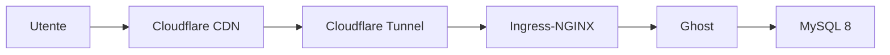

- Ho passato sei mesi a fare debug della registrazione sitemap. La causa era il sottodominio gratuito.
- Ho costruito un cluster k8s per gestire un singolo blog.
- Mi avevano consigliato Astro fin dall'inizio, ho scelto Ghost, e ci sono tornato un anno e mezzo dopo.

---

Ho creato un blog con Hugo intorno al 2024. Lo hostavo su GitHub Pages, scrivevo qualche post, tutto funzionava — tranne una cosa. Google Search Console non accettava la sitemap. `Sitemap: couldn't fetch`. Sei mesi senza soluzione.

Ho controllato le impostazioni SEO di Hugo, verificato robots.txt, validato la sitemap, ispezionato gli header HTTP. 304 Not Modified da una parte, Content-Type mancante dall'altra, favicon.ico che si infilava nel sitemap XML. Correggevo ogni cosa che sembrava sbagliata. Nessun cambiamento. Ho provato a spostare tutto su Cloudflare Pages. Stesso risultato.

Ho iniziato a sospettare che fosse Hugo il problema, così ho fatto un esperimento di controllo con Jekyll. Configurare l'ambiente Ruby su macOS è stata un'avventura a parte, ma alla fine ho deployato su Cloudflare Pages nelle stesse condizioni. Stesso fallimento. Neanche Jekyll riusciva a registrare la sitemap. Il framework non c'entrava — il problema era il sottodominio gratuito (`.github.io`, `.pages.dev`).

## Un dominio da $10

Ho comprato `sungho-gigio.com` da Cloudflare Registrar. $10.46/anno, prezzo at-cost, stesso costo al rinnovo.

All'inizio non funzionava comunque. Avevo registrato il sito come "URL Prefix" property in GSC. Ho cambiato in "Domain" property, verificato la proprietà con un record TXT nel DNS di Cloudflare, e ha funzionato subito. Sei mesi di debug risolti cambiando un tipo di property.

## Perché Ghost

Con la sitemap risolta, il design del blog Hugo mi sembrava un po' scarno, così ho valutato altri framework. Ho chiesto un confronto a ChatGPT — la prima raccomandazione era Astro. Zero JS di default, Islands Architecture, Content Collections. Perfetto per un blog.

Ho scelto Ghost. L'editor WYSIWYG mi piaceva, il SEO era integrato, e avevo già un'istanza ARM gratuita su Oracle Cloud. "Ho un server, tanto vale usarlo."

## k8s per un blog

Decidere di self-hostare Ghost ha fatto escalare le cose. Ho installato k3s su un'istanza ARM64 di Oracle Cloud, configurato GitOps con Argo CD, gestito i secret con Vault, aggiunto il monitoraggio con Prometheus + Grafana + Loki. Esposto tutto con Cloudflare Tunnel, protetto l'admin con Zero Trust.

Tutto questo per gestire un blog. Penso che l'esperienza formativa ne sia valsa la pena, ma mi stavo allontanando sempre di più dallo scrivere.

Una cosa che ho verificato in questa fase: il tier gratuito di Cloudflare è sorprendentemente generoso. Tunnel, Zero Trust (50 utenti), DNS, SSL, Email Routing — tutto gratis.

## Un autore diverso

L'editor WYSIWYG di Ghost è pensato per persone che scrivono nel browser. Dalla fine del 2025, passavo sempre più tempo a lavorare con strumenti come Claude Code, e avevo bisogno che gli agent potessero leggere e scrivere file Markdown direttamente. L'Admin API di Ghost non supporta davvero quel flusso di lavoro.

Avevo scelto Ghost per l'"esperienza di scrittura", ma chi scriveva era passato da me all'AI, e quel criterio aveva smesso di contare. Sono tornato ad Astro — quello che mi avevano consigliato all'inizio. Sito statico, niente k8s, basta fare deploy su Cloudflare Workers & Pages.

| Deviazione | Cosa ho imparato |
|------------|-----------------|
| 6 mesi di debug sitemap | GSC Domain vs URL Prefix property, isolare le cause con esperimenti di controllo |
| Ricerca dominio | Ecosistema registrar, DNS, WHOIS |
| Ghost su k8s | Esperienza pratica con k3s, Argo CD, Vault, Cloudflare Tunnel |
| Ghost → Astro | "Chi è l'utente dello strumento?" |

Se avessi comprato un dominio da $10 e usato Astro dall'inizio, niente di tutto questo sarebbe successo. D'altra parte, neanche questo post esisterebbe.
