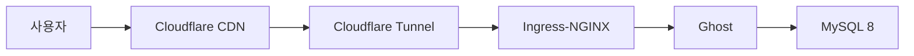

- sitemap 등록 하나에 6개월을 쓴 끝에, 원인이 무료 서브도메인이었다는 걸 알았다.
- 블로그 하나 운영하겠다고 k8s 클러스터를 구축했다.
- Astro를 처음부터 추천받았는데, Ghost를 거쳐 1년 반 만에 돌아왔다.

---

Hugo로 블로그를 만든 건 2024년쯤이다. GitHub Pages에 올려서 글도 쓰고 했는데, 하나가 안 됐다. Google Search Console에 sitemap 등록. `Sitemap: couldn't fetch`라는 에러만 뜨고, 6개월 동안 해결을 못 했다.

Hugo 설정을 뒤지고, robots.txt를 확인하고, sitemap.xml을 밸리데이터에 돌리고, HTTP 응답 헤더를 뜯어봤다. 304 Not Modified가 오거나 Content-Type이 누락돼 있거나, sitemap에 favicon.ico가 끼어 있거나. 문제처럼 보이는 것들을 하나씩 고쳤는데 결과는 같았다. Cloudflare Pages로 플랫폼을 바꿔봐도 마찬가지.

혹시 Hugo 자체가 원인인가 싶어서 Jekyll로 대조 실험을 했다. macOS에서 Ruby 환경 세팅하는 것부터 삽질이었지만, 어쨌든 동일 조건으로 Cloudflare Pages에 배포했다. 결과는 똑같았다. Jekyll에서도 sitemap fetch 실패. 프레임워크가 문제가 아니라 무료 서브도메인(`.github.io`, `.pages.dev`) 자체가 원인이었다.

## $10짜리 도메인

커스텀 도메인을 사면 될 것 같아서 Cloudflare Registrar에서 `sungho-gigio.com`을 샀다. $10.46/년. at-cost 가격이라 갱신비도 같다.

도메인을 연결해도 처음에는 안 됐다. GSC에서 "URL Prefix" property로 등록했기 때문이다. "Domain" property로 바꾸고 Cloudflare DNS TXT 레코드로 인증하니까 바로 됐다. 6개월의 삽질이 property 타입 하나 바꾸는 걸로 끝났다.

## 그래서 Ghost

sitemap은 해결됐는데, Hugo 블로그 디자인이 좀 허전해서 프레임워크를 바꾸고 싶어졌다. ChatGPT한테 비교를 시켰는데 1순위 추천이 Astro였다. 0KB JS 기본, Islands Architecture, Content Collections. 블로그에 딱 맞는 도구.

그런데 나는 Ghost를 골랐다. WYSIWYG 에디터가 좋았고, SEO가 자동이었고, Oracle Cloud 무료 ARM 인스턴스를 이미 갖고 있었다. "서버가 있으니 써보자"는 생각이었다.

## 블로그 하나에 k8s를

Ghost를 self-hosted로 돌리겠다고 하면서 일이 커졌다. Oracle Cloud ARM64 인스턴스에 k3s를 올리고, Argo CD로 GitOps를 구성하고, Vault로 시크릿을 관리하고, Prometheus + Grafana + Loki로 모니터링을 붙였다. Cloudflare Tunnel로 외부 노출, Zero Trust로 어드민 보호.

블로그 하나 운영하려고 이걸 다 세팅한 거다. 학습 가치는 있었다고 생각하는데, 글 쓰는 것과는 점점 거리가 멀어지고 있었다.

이때 확인한 건데, Cloudflare 무료 티어가 꽤 관대하다. Tunnel, Zero Trust(50유저), DNS, SSL, Email Routing이 전부 무료다.

## 글 쓰는 주체

Ghost의 WYSIWYG 에디터는 사람이 브라우저에서 직접 글을 쓰는 데 최적화돼 있다. 2025년 말부터 Claude Code 같은 도구로 작업하는 비중이 늘면서, 에이전트가 Markdown 파일을 직접 읽고 쓸 수 있어야 한다는 필요가 생겼다. Ghost Admin API로는 이게 제한적이다.

처음에 "글쓰기 경험" 때문에 Ghost를 골랐는데, 글을 쓰는 주체가 사람에서 AI로 바뀌면서 그 기준이 무효화됐다. 결국 처음에 추천받았던 Astro로 돌아왔다. 정적 사이트라 k8s가 필요 없고, Cloudflare Workers & Pages에 올리면 끝이다.

| 삽질 | 얻은 것 |
|------|---------|
| sitemap 6개월 | GSC Domain vs URL Prefix property, 대조 실험으로 원인 격리 |
| 도메인 구매 | 레지스트라 생태계, DNS, WHOIS |
| Ghost k8s 구축 | k3s, Argo CD, Vault, Cloudflare Tunnel 실전 경험 |
| Ghost → Astro | "도구의 사용자가 누구인가" |

처음부터 $10짜리 도메인을 사고 Astro를 썼으면 이 모든 과정이 없었을 것이다. 다만 그랬으면 이 글도 없었을 거다.
