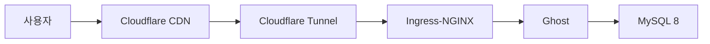

- sitemap 등록 하나에 6개월을 쓴 끝에, 원인이 무료 서브도메인이었다는 걸 알았다.
- 블로그 하나 운영하겠다고 k8s 클러스터를 구축했다.
- Astro를 처음부터 추천받았는데, Ghost를 거쳐 1년 반 만에 돌아왔다.

---

Hugo로 블로그를 만든 건 2024년쯤이다. GitHub Pages에 올려서 글도 쓰고 했는데, 하나가 안 됐다. Google Search Console에 sitemap 등록. `Sitemap: couldn't fetch`라는 에러만 계속 나왔다.

처음엔 Hugo 설정 문제인 줄 알았다. `enableRobotsTXT = true` 확인하고, sitemap.xml을 XML 밸리데이터에 돌려봤다. 통과는 하는데 내용을 뜯어보니 `favicon.ico`가 URL로 들어가 있거나, inline SVG data URI가 끼어 있거나, 이상한 게 좀 있었다. 하나씩 고쳤다.

네트워크 레벨로 내려가서 HTTP 응답도 확인했다. sitemap.xml 요청에 `304 Not Modified`가 오고 있었다. 200이 와야 정상인데. `Content-Type` 헤더도 `application/xml`이어야 하는데 아예 없었다. GitHub Pages가 내부적으로 Jekyll 처리를 하면서 뭔가 건드리는 것 같아서 `.nojekyll` 파일도 추가해봤다. 안 됐다.

Cloudflare Pages로 플랫폼을 옮겨봤다. `sungho-park-gigio.pages.dev`로 배포는 잘 됐는데, GSC sitemap 등록은 여전히 실패. 이쯤 되면 Hugo가 문제인 건지, 호스팅이 문제인 건지 구분이 안 됐다.

대조 실험을 하기로 했다. Jekyll로 동일 조건을 만들어서 확인하는 거다. macOS에서 Ruby 환경 세팅하는 것부터가 일이었다. `gem install jekyll bundler` 하면 시스템 Ruby 권한 문제로 `Gem::FilePermissionError`가 뜬다. rbenv를 설치했는데 여전히 시스템 Ruby를 보길래, `.zshrc`에 `eval "$(rbenv init - zsh)"`를 빼먹은 거였다. 이런 걸로도 시간을 쓴다.

어쨌든 Jekyll 블로그를 Cloudflare Pages에 배포하고 GSC에 등록했다. 결과는 똑같았다. Jekyll에서도 sitemap fetch 실패. 프레임워크가 문제가 아니라는 건 여기서 확정됐다. 무료 서브도메인(`.github.io`, `.pages.dev`) 자체의 문제였을 가능성이 높다는 결론.

## $10짜리 도메인

커스텀 도메인을 사기로 했다. 레지스트라를 좀 비교해봤는데, Cloudflare Registrar가 at-cost 가격이라 마진이 0이다. `.com`이 $10.46/년이고 갱신비도 동일. WHOIS 처리도 레지스트리 레벨에서 삭제(redaction)를 해주는 방식이라 별도 proxy 서비스가 필요 없다. DNS가 Cloudflare에 묶이는 건 단점이라면 단점인데, 어차피 Cloudflare Pages를 쓰고 있으니 상관없었다.

`sungho-gigio.com`을 사고 연결했는데 처음에는 또 안 됐다. GSC에서 "URL Prefix" property로 등록했기 때문이다. "Domain" property로 바꾸고 Cloudflare DNS TXT 레코드로 소유권 인증을 하니까 바로 됐다. 6개월 동안 sitemap XML 포맷을 의심하고, HTTP 헤더를 뜯고, 프레임워크를 바꿔본 건 전부 헛수고였다. Domain property 하나 바꾸는 걸로 끝.

## Ghost를 고른 이유

sitemap은 해결됐는데, Hugo 블로그 디자인이 좀 허전해서 프레임워크를 바꾸고 싶어졌다. ChatGPT한테 비교를 시켰는데 1순위 추천이 Astro였다. 0KB JS 기본, Islands Architecture, Content Collections. 블로그에 딱 맞는 도구.

그런데 나는 Ghost를 골랐다. 이유가 좀 있었다. WYSIWYG 에디터에서 Markdown 카드, 이미지, 수식을 바로 미리보기하면서 쓸 수 있다는 게 좋았다. sitemap이나 meta tags 같은 SEO가 전부 내장이라 빌드 설정을 만질 필요가 없었다. 그리고 Oracle Cloud의 무료 ARM64 인스턴스(4 OCPU, 24GB RAM)를 이미 갖고 있었다. 서버가 있으니 써보자는 생각이었다.

## 블로그 하나에 k8s를

Ghost를 self-hosted로 돌리겠다고 하면서 일이 커졌다.

Oracle Cloud ARM64 인스턴스에 k3s를 올리고, Argo CD로 GitOps를 구성했다. App-of-Apps 패턴에 Kustomize 오버레이로 staging/prod를 나눴다. 시크릿은 HashiCorp Vault에 넣고 VSO(Vault Secrets Operator)로 K8s에 주입했는데, 초기 시크릿 부트스트랩은 SOPS(age 암호화)로 처리하고 Argo CD repo-server에 ksops 사이드카를 붙여서 자동 복호화가 되게 했다.

Cloudflare Tunnel을 replica 2로 돌려서 외부 노출하고, Zero Trust Access로 `/ghost/*` 어드민 경로를 보호했다. 모니터링은 Prometheus + Grafana + Loki + Blackbox Exporter. Uptime Kuma도 붙였다.

Ghost + Ingress-NGINX 조합에서 `X-Forwarded-Proto: https` 헤더를 넣지 않으면 redirect loop에 빠진다는 것도 이때 알았다. Cloudflare Tunnel이 HTTPS 종단을 하면서 백엔드에는 HTTP로 넘기는데, Ghost가 이걸 HTTP 접속으로 인식하고 HTTPS로 리다이렉트를 걸어서 무한루프가 도는 거다.

운영하면서도 이슈가 계속 나왔다. Ghost 컨테이너에서 `bcryptjs` MODULE_NOT_FOUND가 뜨는데, Node의 eval 컨텍스트에서 모듈 경로를 못 찾는 문제였다. npm이 `ENOTEMPTY` 에러를 내는 건 이전에 중단된 설치의 임시 디렉터리가 남아 있어서였다. Ghost에 disposable email 도메인으로 스팸 회원가입이 쏟아지는 건 `config.production.json`에 차단 도메인 리스트를 넣어서 막았다.

블로그 하나 운영하려고 이걸 다 세팅한 거다. 학습 가치는 있었다고 생각하는데, 글 쓰는 것과는 점점 거리가 멀어지고 있었다. 이때 확인한 건데, Cloudflare 무료 티어가 꽤 관대하다. Tunnel, Zero Trust(50유저), DNS, Access(Google/GitHub IdP 연동), Universal SSL, Email Routing이 전부 무료다.

## 글 쓰는 주체가 바뀌었다

Ghost의 WYSIWYG 에디터는 사람이 브라우저에서 직접 글을 쓰는 데 최적화돼 있다. 2025년 말부터 Claude Code 같은 도구로 작업하는 비중이 늘면서 상황이 달라졌다. 에이전트가 Markdown 파일을 직접 읽고 쓸 수 있어야 하는데, Ghost Admin API로는 이게 제한적이다. 프로그래밍적으로 글을 관리하는 워크플로우와 근본적으로 안 맞는다.

처음에 "글쓰기 경험" 때문에 Ghost를 골랐는데, 글을 쓰는 주체가 사람에서 AI로 바뀌면서 그 기준이 무효화됐다. WYSIWYG이 좋다는 건 사람이 직접 타이핑할 때의 이야기다.

결국 처음에 추천받았던 Astro로 돌아왔다. Markdown 파일 기반이라 에이전트가 자유롭게 작업할 수 있고, 정적 사이트라 k8s가 필요 없다. Hugo 시절에는 Cloudflare Pages(정적 사이트 전용)에 올렸었는데, 그 사이에 Cloudflare가 Pages와 Workers를 통합해서 Cloudflare Workers & Pages가 됐다. 지금은 여기에 올려서 운영하고 있다.

| 삽질 | 얻은 것 |
|------|---------|
| sitemap 6개월 | GSC Domain vs URL Prefix property, HTTP 헤더 분석, 대조 실험으로 원인 격리 |
| 도메인 구매 | 레지스트라 생태계, at-cost 가격 구조, WHOIS redaction vs proxy |
| Ghost k8s 구축 | k3s, Argo CD, Kustomize, Vault + SOPS, Cloudflare Tunnel, 모니터링 스택 |
| Ghost → Astro | "도구의 사용자가 누구인가"라는 질문 |

처음부터 $10짜리 도메인을 사고 Astro를 썼으면 이 모든 과정이 없었을 것이다. 다만 그랬으면 이 글도 없었을 거다.
