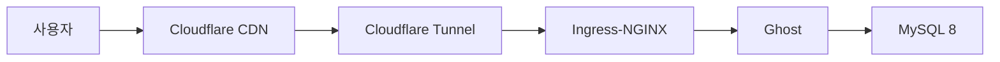

- Hugo, Jekyll, Ghost 모두 블로그로서 동작하지만, 내 환경에서 Google Search Console sitemap 등록이 성공한 건 Ghost부터였다.
- Claude Code가 Astro 3/4만 알고 있어서 Agent Skill을 따로 만들었다.
- 3개 국어 라우팅, 동적 OG 이미지, 전문 검색, JSON-LD까지 에이전트와 함께 구현했다.

---

블로그는 중학생 때부터 해왔다. Blogger.com으로 시작해서 고등학생 때 Tistory, 그 다음 GitHub Pages 기반의 Jekyll을 거쳤다. Hugo로 넘어간 건 2024년쯤인데, GitHub Pages에 올려서 글도 쓰고 했는데 하나가 안 됐다. Google Search Console에 sitemap 등록. `Sitemap: couldn't fetch`라는 에러만 계속 나왔다.

처음엔 Hugo 설정 문제인 줄 알았다. `enableRobotsTXT = true` 확인하고, sitemap.xml을 XML 밸리데이터에 돌려봤다. 통과는 하는데 내용을 뜯어보니 `favicon.ico`가 URL로 들어가 있거나, inline SVG data URI가 끼어 있거나 했다. 하나씩 고쳤다. 네트워크 레벨로 내려가서 HTTP 응답도 확인했는데, sitemap.xml 요청에 `304 Not Modified`가 오고 `Content-Type` 헤더가 아예 없었다. GitHub Pages의 Jekyll 처리 간섭인가 싶어서 `.nojekyll` 파일도 추가해봤다. 안 됐다.

Cloudflare Pages로 플랫폼을 옮겼다. 배포는 잘 됐는데 Google Search Console sitemap 등록은 여전히 실패. Jekyll로 대조 실험도 했다. macOS Ruby 환경 세팅에서 좀 삽질을 했지만 어쨌든 동일 조건으로 배포했더니 역시 같은 실패. 프레임워크 문제는 아니라는 건 여기서 확정됐다.

## 커스텀 도메인

무료 서브도메인(`.github.io`, `.pages.dev`)이 원인인가 싶어서 커스텀 도메인을 샀다. Cloudflare Registrar에서 `sungho-gigio.com`, $10.46/년. at-cost 가격이라 갱신비도 동일하고 WHOIS redaction도 기본 제공이라 괜찮았다.

도메인을 연결하고 Google Search Console에서 Domain property로 등록해봤다. Hugo + 커스텀 도메인 조합에서도 sitemap 등록이 안 됐다. Jekyll + 커스텀 도메인도 마찬가지. 솔직히 이 시점에서 뭐가 문제인지 감을 못 잡고 있었다.

다른 사람들은 Hugo나 Jekyll + 커스텀 도메인 조합에서 아무 이슈 없이 sitemap이 잘 됐을 수도 있다. 내가 파악하지 못한 세팅이 빠져 있었을 가능성도 있고, Google Search Console 쪽의 타이밍 문제였을 수도 있다. 어쨌든 내 환경에서는 안 됐다.

## Ghost와 sitemap

결국 프레임워크를 Ghost로 바꾸면서 sitemap 문제가 해결됐다. Ghost는 sitemap, meta tags, structured data 같은 SEO 기능이 전부 내장이라 별도 설정이 필요 없었다. 커스텀 도메인 + Ghost + Google Search Console Domain property 조합에서 sitemap 등록이 바로 성공했다.

Hugo나 Jekyll에서 안 됐던 게 Ghost에서 된 이유를 정확히 짚기는 어렵다. Ghost가 SEO를 내부적으로 더 잘 처리하는 건지, 아니면 그 사이에 Google Search Console 쪽에서 뭔가 바뀐 건지. 확실한 건 Ghost로 옮긴 시점에 문제가 사라졌다는 것뿐이다.

Ghost를 고른 이유는 sitemap만은 아니었다. WYSIWYG 에디터에서 Markdown 카드, 이미지, 수식을 바로 미리보기하면서 쓸 수 있다는 게 좋았고, Oracle Cloud의 무료 ARM64 인스턴스(4 OCPU, 24GB RAM)를 이미 갖고 있어서 self-hosted로 돌릴 수 있었다.

## k8s 위의 블로그

Ghost를 self-hosted로 돌리면서 인프라가 커졌다. Oracle Cloud ARM64에 k3s를 올리고, Argo CD + Kustomize로 GitOps를 구성하고, Vault + SOPS로 시크릿을 관리하고, Cloudflare Tunnel로 외부 노출, Zero Trust로 어드민 보호, Prometheus + Grafana + Loki로 모니터링까지. 블로그 하나에 이걸 다 세팅한 거다. 인프라 학습에는 좋았는데 글 쓰는 것과는 점점 거리가 멀어졌다.



이때 확인한 건데, Cloudflare 무료 티어가 꽤 관대하다. Tunnel, Zero Trust(50유저), DNS, Access, SSL, Email Routing이 전부 무료.

## Astro로 돌아온 이유

2025년 말부터 Claude Code 같은 도구로 작업하는 비중이 늘면서 상황이 달라졌다. Ghost의 WYSIWYG 에디터는 사람이 브라우저에서 직접 쓸 때 좋은 거고, 에이전트가 Markdown 파일을 직접 읽고 쓰는 워크플로우와는 안 맞았다. Ghost Admin API가 있긴 하지만 제한적이다.

처음에 "글쓰기 경험" 때문에 Ghost를 골랐는데, 글을 쓰는 주체가 사람에서 AI로 바뀌면서 그 기준이 무효화됐다. 결국 처음에 추천받았던 Astro로 돌아왔다. Markdown 파일 기반이라 에이전트가 자유롭게 작업할 수 있고, 정적 사이트라 k8s가 필요 없다. Cloudflare Workers & Pages에 올리면 끝이다.

## 에이전트와 함께 구현한 것들

Astro로 돌아온 뒤에 Claude Code와 Codex로 꽤 많은 걸 구현했다. astro-erudite 테마를 포크해서 시작했는데, 그 위에 올린 것들이 결과적으로 많다.

3개 국어 i18n을 붙였다. `/blog/ko/`, `/blog/en/`, `/blog/it/`으로 언어별 라우팅이 되고, `translationOf` frontmatter로 번역 관계를 연결한다. 포스트마다 언어 스위처가 붙고, hreflang 태그로 검색엔진에 다국어 구조를 알려준다. RSS 피드는 영문 기준으로 나간다.

OG 이미지는 satori + resvg-js로 빌드 타임에 생성한다. Pretendard(한국어)와 Geist(영문) 폰트를 쓰고, 제목 길이에 따라 폰트 크기를 자동 조절한다. 언어별로 별도 이미지가 나온다.

FlexSearch 기반 전문 검색도 만들었다. 빌드 시 JSON 인덱스를 생성해서 클라이언트에서 퍼지 매칭으로 검색한다. 키보드 탐색, 검색 히스토리, localStorage 캐싱이 된다.

JSON-LD 구조화 데이터도 넣었다. BlogPosting, BreadcrumbList, WebSite, Person 스키마가 페이지 타입에 따라 들어간다. 시리즈/서브포스트 시스템, Mermaid 다이어그램, KaTeX 수식 렌더링도 구현했다.

## Astro 6과 Agent Skill

이 과정에서 하나 문제가 있었다. Claude Code가 Astro 코드를 생성할 때 Astro 3/4/5 시절 패턴을 쓴다는 거다. Astro 6에서 `render()`가 standalone 함수로 바뀌었고, Content Collections에 `loader`가 필수가 됐고, Zod 4로 import 경로가 달라졌는데, 에이전트는 이런 breaking change를 모른다. Astro Docs MCP를 붙여도 에이전트가 자기가 틀린 줄 모르니까 MCP에 질문을 안 한다.

그래서 Agent Skill을 따로 만들었다. 에이전트가 코드를 생성하기 전에 참조하는 가드레일 모음이다.

```bash
npx skills add gigio1023/astro-dev-skill
```

GitHub: [gigio1023/astro-dev-skill](https://github.com/gigio1023/astro-dev-skill) / 관련 포스트: [Astro Blog를 위한 Agent Skill](/blog/ko/astro-agent-skill)

## 각 프레임워크에서 배운 것

| 프레임워크 | 배운 것 |
|-----------|---------|
| Hugo | sitemap 디버깅, HTTP 헤더 분석, 대조 실험으로 원인 격리 |
| Jekyll | Ruby 환경 세팅의 고통, 프레임워크 원인 배제 확인 |
| Ghost (k8s) | k3s, Argo CD, Vault + SOPS, Cloudflare Tunnel/Zero Trust, 모니터링 |
| Astro | AI 에이전트 기반 개발, i18n, OG 이미지 생성, 구조화 데이터 |

돌아보면 ChatGPT가 처음부터 Astro를 추천했는데 Ghost를 골랐고, 1년 반 뒤에 결국 Astro로 돌아왔다. 다만 그 사이에 Cloudflare 생태계와 k8s를 실전으로 경험한 건 나쁘지 않았다고 생각한다.
