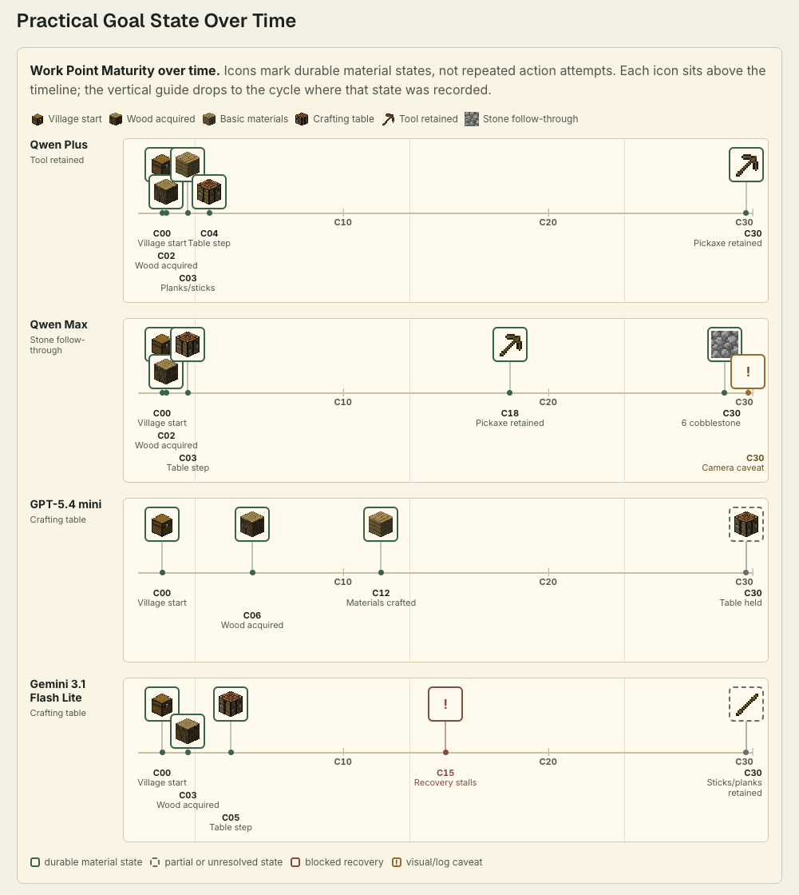

- [상세 리포트](https://gigio1023.github.io/minecraft-llm-agent-community/blog/natural-village-model-comparison)
- [Repository](https://github.com/gigio1023/minecraft-llm-agent-community)

- 마인크래프트 안에서 대규모 언어 모델 에이전트가 실제 게임 상태를 바꾸는지 보고 있다.
- 이번 실행은 자연 마을 근처에서 시작했고, 모델별로 새 월드를 만들었다.
- 목표는 나무, 재료, 작업대, 도구, 돌로 이어지는 작은 재료 작업이었다.
- 자세한 수치와 모델별 화면은 상세 리포트에 두고, 여기에는 읽는 데 필요한 맥락과 그림만 남긴다.

---

요즘 다시 만지고 있는 프로젝트가 있다. 마인크래프트 안에 대규모 언어 모델 에이전트를 넣고, 에이전트가 선택한 행동을 실제 게임 세계에서 실행한 뒤, 그 결과를 기록하는 실험이다.

여기서 에이전트가 하는 일은 채팅으로 계획을 말하는 것과 조금 다르다. 모델은 다음 행동을 제안하고, 실행 코드는 그 행동이 가능한지 확인하고, Mineflayer bot이 마인크래프트 서버에서 움직인다. 그 다음에는 inventory, block 변화, 실행 기록을 보고 실제로 무슨 일이 일어났는지 확인한다.

마인크래프트를 쓰는 이유는 단순하다. 세계가 남는다. 나무를 캤다면 log가 inventory에 들어가야 하고, 작업대를 만들었다면 item이나 block 상태가 바뀌어야 한다. 모델이 "했다"고 말하는 문장보다, 게임 세계에 남은 상태가 더 읽기 쉽다.

## 자연 마을

이번에는 손으로 꾸민 실험장을 쓰지 않았다. 자연 생성된 마을 근처에서 시작했다. scenario는 `natural-village-spawn-v1`, seed는 `4167799982467607063`이었다.

같은 조건에서 여러 모델별 실행 경로를 돌렸다. 원래 리포트에서는 이것을 lane이라고 부른다. 각 lane은 같은 seed를 쓰지만, world는 매번 새로 만들었다. 이전 lane이 남긴 block이나 inventory가 다음 lane에 섞이면 결과를 읽기 어려워지기 때문이다.

각 lane에는 30 cycle을 줬다. 한 cycle은 대략 관찰, 모델 판단, 행동 실행, 결과 기록으로 이어지는 한 번의 행동 주기다. 목표는 다음 문장에 가깝다.

```text
자연 마을 근처의 새 월드에서, 이후 재료 작업을 계속할 수 있는 작은 작업 지점을 만든다.
나무를 모으고, 기본 재료를 만들고, 작업대를 만들거나 사용하고,
막히면 회복하고, inventory와 스크린샷과 실행 기록으로 나중에 검토할 수 있는 상태를 남긴다.
```

목표를 이렇게 잡은 이유는 마인크래프트 초반 작업이 여러 가지를 같이 요구하기 때문이다. 나무를 찾아야 하고, item을 주워야 하고, 재료를 만들어야 하고, 작업대 주변에서 행동을 이어가야 한다. 중간에 이동이나 block 접근이 꼬이면 회복도 해야 한다.

## 그림 읽기

자세한 수치, 스크린샷, lane별 card는 위의 상세 리포트에 정리해두었다. 이 글에서는 아래 그림만 보면 된다.



이 그림은 행동 시도를 모두 세지 않는다. 같은 행동을 여러 번 반복해도 world에 더 유용한 상태가 남지 않으면 progress로 보지 않았다. 대신 남은 상태만 표시했다. wood acquired는 나무를 얻었다는 뜻이고, basic materials는 planks나 sticks 같은 기본 재료가 생겼다는 뜻이다. crafting table은 작업대 단계에 도달했다는 뜻이고, tool retained는 도구가 마지막까지 남았다는 뜻이다. stone follow-through는 나무 도구 이후 cobblestone까지 이어졌다는 뜻이다.

결과를 짧게 적으면 Qwen Max lane이 가장 깊은 재료 상태까지 갔다. 작업대 단계 이후 wooden pickaxe를 유지했고, 마지막에는 cobblestone 6개가 기록됐다. Qwen Plus는 wooden pickaxe가 남은 wood-level work point까지 갔다. GPT-5.4 mini는 재료와 작업대를 들고 있었지만, 작업 지점이 안정적으로 이어지지는 않았다. Gemini 3.1 Flash Lite는 table step까지 갔다가 회복 과정에서 많이 멈췄다.

이 결과는 모델 순위표로 읽기에는 조건이 좁다. ModelScope에서는 Qwen Plus와 Qwen Max를 썼고, OpenAI와 Gemini 쪽은 내가 사용할 수 있던 무료 또는 낮은 quota 안에서 reference lane으로 돌렸다. GPT-5.5나 Claude Opus 4.8 같은 유료 최상위 모델을 비교한 실행은 포함하지 않았다.

## 증거

스크린샷은 사람이 읽기 위한 자료다. bot이 어디에 있는지, 카메라가 어떤 장면을 보고 있는지, 실행이 실제 마인크래프트 화면과 연결되어 있는지 확인하는 데 도움이 된다.

그래도 block identity나 재료 진행을 픽셀만 보고 정하지는 않았다. 이 글에서 말하는 재료 관련 주장은 inventory, observe와 world-state scan, runtime status, action record를 같이 보고 읽은 것이다.

Qwen Max의 마지막 third-person camera에는 지형 단면처럼 보이는 camera artifact가 있었다. 그래서 stone progress는 화면만 보고 말하지 않았다. inventory와 world-state 기록에서 cobblestone이 남았는지를 기준으로 삼았다.

## 다음 질문

이번 실행이 보여준 범위는 작다. 사회적 행동이 생겼다는 주장까지 가지 않는다. 대규모 언어 모델이 action-consequence target을 학습했다는 주장도 하기 어렵다. 지금 말할 수 있는 것은 harness가 자연 마을에서 작은 재료 작업 실험을 돌릴 만큼 가까워졌다는 정도다.

다음에는 목표를 더 좁히는 편이 좋아 보인다. 예를 들면 "작업대를 놓고, 그 주변에서 다음 재료 작업을 이어갈 수 있는 상태를 유지하라" 정도다. shelter, storage, navigation recovery, long-horizon continuity를 한 번에 넣으면 실패 원인이 너무 많이 섞인다.

그래도 이번 실행은 쓸모가 있었다. 자연 마을에서 시작해도, 모델의 말보다 inventory와 world state를 먼저 보면서 다음 실험을 설계할 수 있게 됐다.
