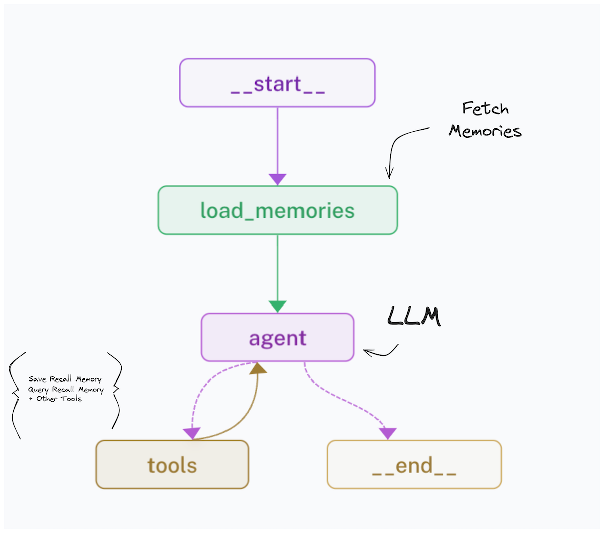
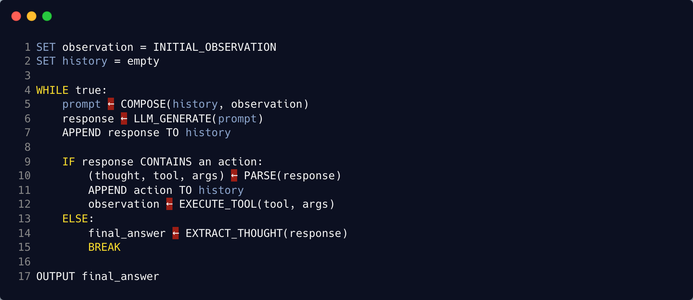
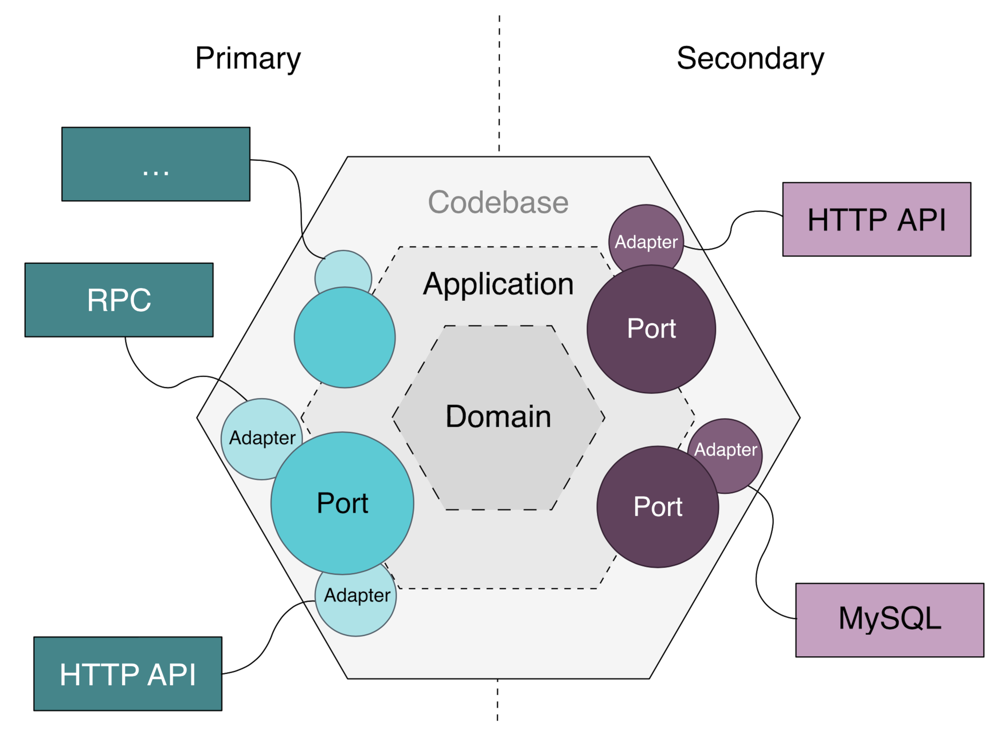

- Ho presentato a LangCon 2025 sulle sfide pratiche nello sviluppo di agenti nel mondo reale
- Il concetto di "buon" agente cambia tra accademia, social media e produzione
- Il vero collo di bottiglia non e la logica dell'agente ma la progettazione dei tool e l'infrastruttura LLM
- Ho trattato la conversione da Open API Specification a tool, il pattern Port and Adapter, la valutazione con LLM-as-Judge

---

Ho avuto l'opportunita di presentare "Rethinking about Agent and Tools" a LangCon 2025. Non sono sicuro di averlo organizzato bene, ma volevo raccogliere le sfide tecniche che si incontrano costruendo agenti e farne un materiale di riferimento. Le slide sono pensate per essere autoesplicative.

## Tre definizioni di "buono"

La definizione di agente e semplice. Un'applicazione con un piano che puo verificare se ha raggiunto il suo obiettivo. Un tool e una funzione che l'agente puo chiamare. Definizioni approssimate per facilitare la discussione, ma nel momento in cui si aggiunge "buono", le prospettive divergono.

In accademia, un buon agente propone un nuovo dominio o migliora metodi esistenti. "Language Models as Zero-Shot Planners" di Huang et al. (2022), che ha dimostrato capacita di planning con GPT-3 e Sentence-BERT, e un esempio noto. Per i tool, OctoTools di Lu et al. (2025) ha proposto un Unified Agent Framework su 16 benchmark. Framework integrati con valutazione rigorosa sono il riferimento.

Sui social media, il metro e piu vicino a un PoC accattivante. AutoGPT nel 2023 e stato il caso emblematico: piu esplorazione di possibilita che prontezza per la produzione. Per i tool, la domanda e quanto facilmente qualcosa si integra in esempi diversi. ReaderLM-v2 di Jina, che converte HTML in Markdown, ha attirato attenzione in questo modo.

In produzione, i criteri cambiano di nuovo. Un buon agente deve mostrare un ROI chiaro: basso costo, alta qualita, risolvere use case prima intrattabili o rafforzare quelli esistenti. Perplexity, che ha preso idee di agenti basati su ricerca dalla comunita open-source e le ha trasformate in un servizio curato, e un esempio. I buoni tool devono avere qualita di risposta affidabile, gestione pratica di autenticazione e rate limit, e costo di implementazione realistico.

Definire un'utilita universale e difficile. Ma sembra esserci un punto in comune tra tutte e tre le prospettive: ovunque si costruiscano agenti, il collo di bottiglia tende a essere fuori dall'agente stesso.

## I tool sono il collo di bottiglia

Quando si costruiscono agenti, cio che richiede piu tempo non e il loop dell'agente. E capire come definire e collegare i tool.

Il caso piu comune e convertire RESTful API definite con Open API Specification in schemi di function calling per LLM. Sembra una semplice traduzione spec-to-code, ma i generator open-source esistenti raramente si adattano al caso specifico, e si finisce per scrivere codice a mano. Con lo spec OpenAI, bisogna costruire un functions schema generator, consultando l'OpenAI Python SDK per la struttura dello schema. Servizi come composio.dev gestiscono questa traduzione da script Python a spec di function calling. L'esistenza stessa di questi servizi dice qualcosa sulla tediosita del processo.

La web search e simile. E il tool use case piu diffuso, ma il lavoro infrastrutturale e piu pesante del previsto: crawling, pulizia delle pagine, riassunti. Richiede piu mani di data engineering che di AI engineering. In contesti enterprise, spesso bisogna costruire la pipeline di ricerca interna (crawler, parser, search engine) da zero. Per progetti personali, Tavily o Firecrawl sono piu realistici. Gemini supporta nativamente Google Search come tool, con 1.500 richieste gratuite al giorno e $35 per 1.000 successive.

C'e anche l'approccio di usare i tool non come semplici funzioni ma come feature core dell'agente. Se si implementa la personalizzazione come memoria a KnowledgeTriple (subject, predicate, object), l'LLM puo generare e salvare materiale di personalizzazione in un vector store a ogni iterazione. La progettazione dei tool finisce per determinare le capacita dell'agente.

## Implementazione e astrazione

Come implementare l'agente e un'altra questione. In Python, l'implementazione da zero e stata la piu comoda e veloce. Dall'ecosistema open-source ho usato solo FastAPI, OpenAI Python SDK e LiteLLM Proxy. Unificare il layer infrastrutturale LLM sullo spec OpenAI mantiene le cose pulite. Molti ML engineer orientati al backend hanno le proprie soluzioni, e la velocita con cui ogni azienda ci arriva varia.

Nella presentazione ho mostrato come costruire un agente ReAct su un modello aziendale servito con vLLM OpenAI Compatible Server. LangChain offre prototyping rapido e buona compressione del codice, ma il behavior spec dell'agente resta fisso, il debugging e piu difficile e modificare gli internals della libreria e doloroso. L'implementazione propria ha piu costo iniziale e boilerplate, ma si adatta ai requisiti piu facilmente e permette di usare funzionalita specifiche di ogni provider. Structured Output e un esempio tipico.

Sono partito da un semplice pseudo code e con o3-mini ho prodotto un agente ReAct in 134 righe di Python. Il codice e su [gist](https://gist.github.com/gigio1023/f383dd337385d5f8e11ca2688b8bb937).

Per usare gli LLM dentro l'agente, il pattern Port and Adapter e una soluzione pulita. Si definisce un'interfaccia astratta LLMProviderService, si implementano adapter per ogni provider (OpenAI, LoraX, etc.), e lo scambio di provider diventa trasparente per il codice applicativo. Combinato con vLLM OpenAI Compatible Server o LiteLLM Proxy, si e a posto.

## Valutazione e costi

Per la valutazione degli agenti in sistemi conversazionali, LLM-as-Judge e l'approccio pratico. Il pairwise comparison di MT-Bench, l'answer grading e il reference-guided grading sono buoni riferimenti, e WildBench mostra che la valutazione da log di conversazione casuali e fattibile. Il punto chiave e calibrare il budget per valutazione per trovare cadenza e scala realistiche. Partire da circa $5 per round di valutazione e un baseline ragionevole.

Raggiungere basso costo e alta qualita significa eseguire sia valutazioni end-to-end che per modulo per definire lo sweet spot costo-prestazioni. Si riduce a decidere quale modello va in quale modulo e dove il rapporto parametri-prestazioni funziona meglio.

Questo e il mio modo di organizzare il problema. Altri avranno il proprio framework.

## References

- Huang, W., Abbeel, P., Pathak, D., & Mordatch, I. (2022). [Language Models as Zero-Shot Planners: Extracting Actionable Knowledge for Embodied Agents](https://arxiv.org/abs/2201.07207). ICML 2022.
- Lu, P., Chen, B., Liu, S., Thapa, R., Boen, J., & Zou, J. (2025). [OctoTools: An Agentic Framework with Extensible Tools for Complex Reasoning](https://arxiv.org/abs/2502.11271). arXiv:2502.11271.
- Zheng, L., Chiang, W., Sheng, Y., et al. (2023). [Judging LLM-as-a-Judge with MT-Bench and Chatbot Arena](https://arxiv.org/abs/2306.05685). NeurIPS 2023.
- Lin, B.Y., Deng, Y., Chandu, K., et al. (2024). [WildBench: Benchmarking LLMs with Challenging Tasks from Real Users in the Wild](https://arxiv.org/abs/2406.04770). arXiv:2406.04770.
- LINE Engineering. [Port and Adapter Architecture](https://engineering.linecorp.com/ko/blog/port-and-adapter-architecture).
