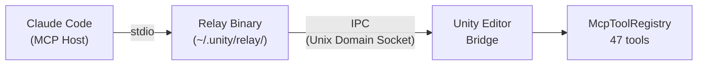
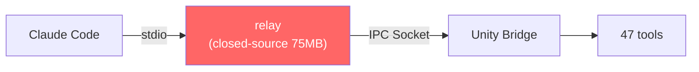
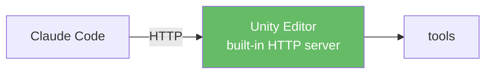

I'd been using [CoplayDev/unity-mcp](https://github.com/CoplayDev/unity-mcp) to integrate Claude Code with Unity via MCP. It works well enough, but the **server connection drops frequently**. When Unity does a domain reload or script compilation, the HTTP server seems to die. Having to reconnect MCP mid-session gets old fast.

So I went looking for alternatives and found Unity's official MCP package (`com.unity.ai.assistant`). It's pre-release, but official — I figured it might be more stable. Long story short, it wasn't. It didn't work at all. Unity's infrastructure was perfectly fine. I connected to the IPC socket directly with Python and confirmed a successful handshake. But the **relay binary returned an empty array for `tools/list`**, making every tool unavailable. The relay is a 75MB closed-source Bun bundle, so there was no way to look inside.

This was a pretty deep rabbit hole. Documenting it here.

---

## What I was using: CoplayDev/unity-mcp

[CoplayDev/unity-mcp](https://github.com/CoplayDev/unity-mcp) runs an HTTP server directly inside the Unity Editor. No relay, no middleman — Claude Code connects via HTTP. Plenty of tools, open source.

It works, but the connection drops often. Whenever Unity does a domain reload or recompiles scripts, the HTTP server goes down. You have to reconnect MCP each time, and during longer sessions this happens a lot.

This is what made me try the official package — hoping it would handle reconnection better.

## Background: Unity's official MCP

The official package is `com.unity.ai.assistant`, and the latest version as of 2026-03 is `2.2.0-pre.1`. It's the last of 20 published versions, and every single one is pre-release.

## The architecture is unusual

MCP supports two transports: **stdio** and **HTTP**. Most MCP servers — GitHub, Docker, you name it — use one of these directly.

Unity is different. The Unity Editor is an already-running process that Claude Code can't start on its own. So they introduced a **relay binary** as a middleman, connecting to the Editor via IPC (Unix Domain Socket).



The reasoning makes sense — you need a middleman to attach to a running process. But this chain has 3 failure points, and if any single one breaks, the whole thing hangs. CoplayDev/unity-mcp does it with just HTTP.

## Setup

Followed the official docs ([Get started with Unity MCP](https://docs.unity3d.com/Packages/com.unity.ai.assistant@2.2/manual/unity-mcp-get-started.html)):

```bash
# Register MCP server in Claude Code
claude mcp add unity-mcp -- \
  ~/.unity/relay/relay_mac_arm64.app/Contents/MacOS/relay_mac_arm64 --mcp
```

On the Unity side:
1. `Edit → Project Settings → AI → Unity MCP` — confirm Bridge is **Running**
2. Pending Connections → **Accept**

Should have been done here. It wasn't.

## The relay binary doesn't exist

Unity's docs say the relay binary gets auto-copied to `~/.unity/relay/` on Editor startup. In reality, only `relay.json` (149 bytes) was there. No binary.

```bash
$ ls ~/.unity/relay/
relay.json  # That's it
```

This is a known bug reported on [Unity Issue Tracker UUM-136700](https://issuetracker.unity3d.com/issues/gateway-relay-binary-not-copied-to-slash-dot-unity-slash-relay-slash-on-editor-startup-macos) (6000.3.10f1 + ai.assistant 2.0.0-pre.1). The binary was buried deep in the Package Cache:

```
Library/PackageCache/com.unity.ai.assistant@df09423d72a0/
  RelayApp~/relay_mac_arm64.app/Contents/MacOS/relay_mac_arm64  (75MB)
```

Manual `cp -R` to fix. First hurdle down.

## Approval pending — infinite hang

When the relay connects to the IPC socket, Unity Bridge requires user approval. The problem: **the relay gives zero response until approved**. Claude Code's MCP implementation has no timeout, so the entire session freezes until you switch to Unity Editor and click Accept. No indication of why it's hanging.

I connected to the IPC socket directly with Python to confirm this was a Unity-side behavior:

```python
import socket, json

sock = socket.socket(socket.AF_UNIX, socket.SOCK_STREAM)
sock.connect('/tmp/unity-mcp-aa22b6cd-56655')

msg = json.dumps({
    'jsonrpc': '2.0', 'id': 1, 'method': 'initialize',
    'params': {'protocolVersion': '2024-11-05', 'capabilities': {},
               'clientInfo': {'name': 'test', 'version': '1.0'}}
})
sock.send((msg + '\n').encode())

# Response:
# {"type":"approval_pending","message":"Connection approval pending user decision"}
```

After clicking Accept in Unity Editor, the handshake proceeds:

```json
{"type":"handshake","protocol":"unity-mcp","version":"2.0"}
```

If you don't know about this step, good luck figuring out why Claude Code is frozen.

Also worth noting: once you Revoke a connection, the client gets permanently denied (`{"type":"approval_denied","reason":"Connection previously denied by user"}`). You have to Stop → Start the Bridge to reset it. None of this is in the docs.

## `tools: []` — The real problem

After clearing all the above hurdles, the relay's `tools/list` response was still an empty array. This is the core issue.

Sent MCP messages to the relay directly:

```bash
(echo '{"jsonrpc":"2.0","id":1,"method":"initialize",...}';
 sleep 2;
 echo '{"jsonrpc":"2.0","method":"notifications/initialized"}';
 sleep 5;
 echo '{"jsonrpc":"2.0","id":2,"method":"tools/list","params":{}}';
 sleep 3) | relay_mac_arm64 --mcp --project-path /path/to/project 2>/dev/null
```

Response:
```json
{"result":{"tools":[]},"jsonrpc":"2.0","id":2}
```

Adding `--project-path` showed a `Discovery filter: projectPath=..., editorPid=(any)` log, but the result was the same. Direct `tools/call` attempt:

```
"Tool 'Unity_GetConsoleLogs' not found. Available tools: "
```

Empty string after "Available tools:".

But inside Unity Editor, the tools are registered and ready:

```
# Editor.log
[McpToolRegistry] Registered tool 'Unity_ManageScene'
[McpToolRegistry] Registered tool 'Unity_ManageGameObject'
[McpToolRegistry] Registered tool 'Unity_RunCommand'
... (47 tools)
```

The tools exist inside Unity. The relay just can't fetch them.

## Infrastructure verification — Unity side is fine

To narrow down the problem, I verified each Unity-side component individually.

**Editor & Bridge** — Confirmed PID with `ps aux`, Bridge Running in Project Settings. Editor.log:

```
MCP Bridge V2 started using Unix Socket at /tmp/unity-mcp-aa22b6cd-56655 (OS=OSXEditor)
Saved connection info to ~/.unity/mcp/connections/bridge-aa22b6cd-56655.json
```

**IPC Socket** — Direct Python connection succeeded through handshake. Unity properly opens the socket, handles approval, and responds with v2.0 protocol.

**Discovery File** (`~/.unity/mcp/connections/bridge-aa22b6cd-56655.json`):

```json
{
  "connection_type": "named_pipe",
  "connection_path": "/tmp/unity-mcp-aa22b6cd-56655",
  "status": "ready",
  "protocol_version": "2.0",
  "editor_pid": 56655
}
```

(Side note: 12 stale discovery files from previous sessions had accumulated — PIDs 66095, 56876, 63563, etc. Cleaned them all up, kept only the current one. Same result.)

**Tool Registration** — 47 tools confirmed in Editor.log. **Relay Binary** — SHA matched between Package Cache and `~/.unity/relay/` (`eefc39db5ea7`). Latest v1.0.11.

Nothing left to check on the Unity side.

## Digging into the relay process

Traced the relay process network connections with `lsof`. This is where I found the smoking gun.

Editor-spawned relay (`--relay` mode):
```
relay_mac 20992  TCP localhost:9001 → localhost:56249 (ESTABLISHED)
```
Connected to Unity via TCP.

Claude Code-spawned relay (`--mcp` mode):
```
relay_mac 48627  unix → stdio (Claude Code)
```
**Zero TCP connections to Unity.** Zero IPC connections. Only stdio to Claude Code.

The relay logs showed the same pattern repeating:

```
connection.established
  → (seconds later)
Relay->Editor communication is blocked
  → Client disconnected
  → Auto-shutdown timer started (180s)
```

Connection starts, then immediately drops. The Editor relay's HTTP endpoint confirms it:

```bash
$ curl localhost:9002/mcp/server-status -d '{"name":"unity"}'
{"serverName":"unity","isProcessRunning":false}
```

The MCP Server process inside the relay was never running.

## Root cause hypothesis

The relay binary is closed-source (75MB Bun bundle), so I can't look inside. Based on the evidence:

**Protocol version mismatch seems most likely.** The relay metadata says `protocolVersion: "1.0"` (unity-ai-relay v1.0.11), while the Bridge responds with `protocol: "2.0"`. The handshake passes, but the tool listing protocol might differ, causing the Claude-side relay to fail silently when trying to connect to Unity.

Timing could also be a factor. If the Bridge needs to push the tool list separately after handshake, the relay might not be waiting for it and returning an empty list immediately.

In the end, `2.2.0-pre.1` is pre-release. The relay auto-copy failure (UUM-136700) is from the same package. It's not production quality yet.

## Claude Code's MCP implementation has issues too

This isn't just a Unity problem.

**No timeout on MCP tool calls.** [Issue #15945](https://github.com/anthropics/claude-code/issues/15945) reports a 16+ hour hang. [#17662](https://github.com/anthropics/claude-code/issues/17662) reports that the `MCP_TOOL_TIMEOUT` environment variable is silently ignored. With a timeout, I would have gotten an error message instead of an infinite hang.

**`claude mcp list` reports "Connected" but doesn't check tool availability.** It only confirms the relay process started. I trusted "Connected" and wasted a lot of time before realizing it meant nothing.

## Everything I tried

| # | Attempt | Result |
|---|---------|--------|
| 1 | Official guide `--mcp` only | tools: [] |
| 2 | Added `--mcp --project-path` | Discovery filter working, tools: [] |
| 3 | Cleaned 12 stale discovery files | No change |
| 4 | Unity Bridge Stop → Start | No change |
| 5 | Killed all zombie processes, restarted | No change |
| 6 | Direct IPC socket connection test | Handshake succeeded (Unity is fine) |
| 7 | Revoke → Re-approve connection | approval_denied → re-approved → tools: [] |
| 8 | Restarted Claude Code 5+ times | "Connected" every time, 0 tools every time |
| 9 | Disabled Auto Refresh | No change |
| 10 | Disabled Domain Reload | Already set, no change |

10 attempts, all failed. After #6 confirmed Unity was working correctly, I was certain the problem was inside the relay binary. Closed source, so I couldn't dig any further.

## Comparison: CoplayDev/unity-mcp vs Official MCP

**Official MCP (broken)**


**CoplayDev/unity-mcp (works)**


CoplayDev/unity-mcp is a simple single-hop HTTP architecture. The official package introduces a relay middleman that adds failure points. CoplayDev has connection drop issues, but at least the tools work. The official package can't even discover tools.

## Conclusion

The official MCP's relay architecture was the problem. In the stdio → relay → IPC → Bridge chain, the relay couldn't establish a connection to Unity, and since the relay is closed-source, the investigation hit a wall.

I went back to CoplayDev/unity-mcp. The connection drop issue is still there, but it's better than tools not being discovered at all. I'll try the official package again when it stabilizes. Pre-release is pre-release.

Claude Code's MCP implementation made things worse with no timeout and misleading "Connected" status. When one MCP server hangs, the entire session dies.

## Environment

- macOS Sequoia (Apple Silicon M1 Pro 16GB)
- Unity 6000.3.11f1
- `com.unity.ai.assistant@2.2.0-pre.1`
- relay: `unity-ai-relay v1.0.11`, SHA `eefc39db5ea7`
- Bridge protocol: v2.0
- Claude Code v2.1.x (Opus 4.6)

---

*This analysis was performed with Claude Code (Opus 4.6), including direct IPC socket testing with Python, relay process tracing via `lsof`, Editor.log analysis, and Unity Issue Tracker research. This may be specific to my environment — if you've tried the same setup, I'd appreciate hearing about your experience.*
