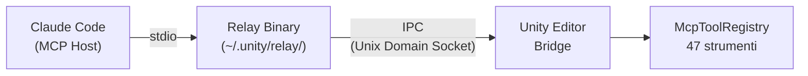
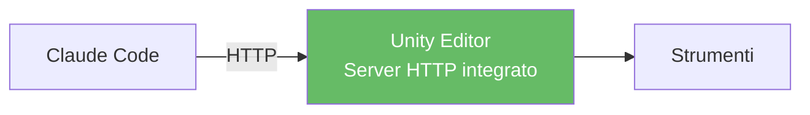

> **TL;DR** — CoplayDev/unity-mcp si disconnetteva spesso, quindi ho provato l'MCP ufficiale di Unity. Il relay restituisce un array vuoto per `tools/list`, rendendo impossibile usare qualsiasi strumento. Alla fine sono tornato a CoplayDev.

In un progetto Unity stavo usando Claude Code con MCP tramite [CoplayDev/unity-mcp](https://github.com/CoplayDev/unity-mcp). Le funzionalità andavano bene, ma il **server si disconnetteva spesso**. Quando la connessione cade durante il lavoro bisogna riavviare il server MCP, e se succede ripetutamente diventa parecchio frustrante.

Cercando alternative, ho trovato il pacchetto MCP ufficiale di Unity (`com.unity.ai.assistant`). È in pre-release, ma essendo ufficiale mi aspettavo più stabilità. La conclusione è che è stato un fallimento. L'infrastruttura lato Unity era tutta funzionante e ho verificato l'handshake collegandomi direttamente al socket IPC con Python, ma il **relay binary restituiva un array vuoto per `tools/list`**, rendendo impossibile usare qualsiasi strumento. Il relay è un bundle Bun closed source da 75MB, quindi non si può nemmeno ispezionare.

Ho fatto parecchia fatica, quindi lo documento.

---

## Quello che usavo: CoplayDev/unity-mcp

[CoplayDev/unity-mcp](https://github.com/CoplayDev/unity-mcp) fa girare un server HTTP direttamente nell'Unity Editor. Senza processi intermedi come relay, Claude Code si collega direttamente via HTTP. Gli strumenti sono sufficienti ed è open source.

Funziona bene, ma il server si disconnette spesso. Quando l'Unity Editor fa il domain reload o la compilazione degli script, il server HTTP sembra morire. Bisogna ricollegare l'MCP ogni volta, e nelle sessioni lunghe le disconnessioni sono frequenti.

Per questo ho voluto provare `com.unity.ai.assistant`, sperando che il pacchetto ufficiale avesse risolto il problema.

## Background dell'MCP ufficiale Unity

Il pacchetto ufficiale è `com.unity.ai.assistant`, versione più recente `2.2.0-pre.1` a marzo 2026. 20 versioni, tutte pre-release.

## L'architettura è un po' particolare

Lo standard MCP supporta due transport: **stdio** e **HTTP**. La maggior parte dei server MCP (GitHub MCP, Docker MCP, ecc.) comunica direttamente con uno dei due.

Unity è diverso. L'Unity Editor è un processo già in esecuzione che Claude Code non può avviare direttamente. Quindi si usa un **relay binary** come processo intermedio, che si collega all'Editor tramite IPC (Unix Domain Socket).



Collegare un processo già in esecuzione tramite un intermediario ha senso. Però ci sono 3 punti di failure, e basta che uno si rompa per bloccare tutto. CoplayDev/unity-mcp con un solo HTTP è molto più semplice.

## Setup

Ho seguito la documentazione ufficiale ([Get started with Unity MCP](https://docs.unity3d.com/Packages/com.unity.ai.assistant@2.2/manual/unity-mcp-get-started.html)).

```bash
# Registrare il server MCP in Claude Code
claude mcp add unity-mcp -- \
  ~/.unity/relay/relay_mac_arm64.app/Contents/MacOS/relay_mac_arm64 --mcp
```

Lato Unity:
1. `Edit -> Project Settings -> AI -> Unity MCP`: verificare che il Bridge sia **Running**
2. Cliccare **Accept** nelle Pending Connections

Secondo la documentazione dovrebbe finire qui. Ma i problemi iniziano da questo punto.

## Il relay binary non c'è

La documentazione Unity dice che il relay binary viene copiato automaticamente in `~/.unity/relay/` all'avvio dell'Editor. In realtà c'era solo `relay.json` (149 bytes) senza il binario.

```bash
$ ls ~/.unity/relay/
relay.json  # solo questo
```

Era un bug noto riportato su [Unity Issue Tracker UUM-136700](https://issuetracker.unity3d.com/issues/gateway-relay-binary-not-copied-to-slash-dot-unity-slash-relay-slash-on-editor-startup-macos) (6000.3.10f1 + ai.assistant 2.0.0-pre.1). Il binario originale era nascosto nel Package Cache:

```
Library/PackageCache/com.unity.ai.assistant@df09423d72a0/
  RelayApp~/relay_mac_arm64.app/Contents/MacOS/relay_mac_arm64  (75MB)
```

Risolto con `cp -R` manuale. Primo ostacolo.

## Attesa infinita per l'approvazione

Quando il relay si avvia, il Unity Bridge richiede approvazione della connessione. Il problema è che il relay non risponde a nulla fino all'approvazione. Claude Code MCP non ha timeout, quindi l'intera sessione si blocca finché l'utente non va nell'Unity Editor e clicca Accept. Nessun messaggio spiega perché è bloccato.

Per verificare se fosse davvero un problema lato Unity, mi sono collegato direttamente al socket IPC con Python:

```python
import socket, json

sock = socket.socket(socket.AF_UNIX, socket.SOCK_STREAM)
sock.connect('/tmp/unity-mcp-aa22b6cd-56655')

msg = json.dumps({
    'jsonrpc': '2.0', 'id': 1, 'method': 'initialize',
    'params': {'protocolVersion': '2024-11-05', 'capabilities': {},
               'clientInfo': {'name': 'test', 'version': '1.0'}}
})
sock.send((msg + '\n').encode())

# Risposta:
# {"type":"approval_pending","message":"Connection approval pending user decision"}
```

Cliccando Accept nell'Unity Editor, l'handshake procede:

```json
{"type":"handshake","protocol":"unity-mcp","version":"2.0"}
```

Senza sapere in anticipo di questo processo, è difficile trovare la causa. Claude Code si blocca e basta.

Inoltre, una volta fatto Revoke, il client viene rifiutato permanentemente. Si riceve `{"type":"approval_denied","reason":"Connection previously denied by user"}`, e bisogna fare Stop -> Start del Bridge per resettare. Anche questo non è documentato.

## `tools: []` — il vero problema

Dopo aver superato tutti gli ostacoli, la risposta di `tools/list` dal relay era un array vuoto. Questo è il problema principale.

Ho mandato messaggi MCP direttamente al relay per verificare:

```bash
(echo '{"jsonrpc":"2.0","id":1,"method":"initialize",...}';
 sleep 2;
 echo '{"jsonrpc":"2.0","method":"notifications/initialized"}';
 sleep 5;
 echo '{"jsonrpc":"2.0","id":2,"method":"tools/list","params":{}}';
 sleep 3) | relay_mac_arm64 --mcp --project-path /path/to/project 2>/dev/null
```

Risposta:
```json
{"result":{"tools":[]},"jsonrpc":"2.0","id":2}
```

Aggiungendo `--project-path` appare `Discovery filter: projectPath=..., editorPid=(any)` nei log, ma il risultato era lo stesso. Anche provando `tools/call` direttamente:

```
"Tool 'Unity_GetConsoleLogs' not found. Available tools: "
```

"Available tools:" seguito da stringa vuota.

Eppure all'interno dell'Unity Editor gli strumenti sono registrati normalmente:

```
# Editor.log
[McpToolRegistry] Registered tool 'Unity_ManageScene'
[McpToolRegistry] Registered tool 'Unity_ManageGameObject'
[McpToolRegistry] Registered tool 'Unity_RunCommand'
... (47)
```

Gli strumenti ci sono in Unity, ma il relay non riesce a recuperarli.

## Verifica che il lato Unity sia ok

Ho verificato punto per punto.

**Editor & Bridge** — PID confermato con `ps aux`, Bridge Running nelle Project Settings. Editor.log normale:

```
MCP Bridge V2 started using Unix Socket at /tmp/unity-mcp-aa22b6cd-56655 (OS=OSXEditor)
Saved connection info to ~/.unity/mcp/connections/bridge-aa22b6cd-56655.json
```

**Socket IPC** — Connessione diretta con Python, handshake riuscito. Unity apre il socket normalmente, approva e risponde con protocollo v2.0.

**File Discovery** — `~/.unity/mcp/connections/bridge-aa22b6cd-56655.json`:

```json
{
  "connection_type": "named_pipe",
  "connection_path": "/tmp/unity-mcp-aa22b6cd-56655",
  "status": "ready",
  "protocol_version": "2.0",
  "editor_pid": 56655
}
```

(C'erano 12 file stale di sessioni precedenti. Li ho puliti tutti lasciando solo quello corrente, senza cambiamenti.)

**Registrazione strumenti** — 47 strumenti confermati nell'Editor.log. **Versione relay binary** — SHA identico tra Package Cache e `~/.unity/relay/` (`eefc39db5ea7`). Ultima versione v1.0.11.

Il lato Unity non aveva problemi.

## Ho analizzato il processo relay

Ho tracciato le connessioni di rete del processo relay con `lsof`.

Relay avviato dall'Editor (modalità `--relay`):
```
relay_mac 20992  TCP localhost:9001 -> localhost:56249 (ESTABLISHED)
```
Collegato a Unity via TCP.

Relay avviato da Claude Code (modalità `--mcp`):
```
relay_mac 48627  unix -> stdio (Claude Code)
```
**Nessuna connessione TCP a Unity, nessuna connessione IPC.** Solo stdio con Claude Code.

Nei log del relay lo stesso pattern si ripeteva:

```
connection.established
  -> (dopo pochi secondi)
Relay->Editor communication is blocked
  -> Client disconnected
  -> Auto-shutdown timer started (180s)
```

La connessione sembra stabilirsi ma si interrompe subito. Anche l'endpoint HTTP del relay dell'Editor (`localhost:9002/mcp/server-status`):

```bash
$ curl localhost:9002/mcp/server-status -d '{"name":"unity"}'
{"serverName":"unity","isProcessRunning":false}
```

Il processo MCP Server all'interno del relay non era nemmeno in esecuzione.

## Causa probabile

Il relay binary è closed source (bundle Bun da 75MB) quindi non posso ispezionarlo. Dai log:

**L'incompatibilità di versione del protocollo sembra la causa più probabile.** I metadata del relay indicano `protocolVersion: "1.0"` (unity-ai-relay v1.0.11), mentre il Bridge risponde con `protocol: "2.0"`. L'handshake passa, ma il protocollo per scambiare la lista degli strumenti potrebbe essere diverso, impedendo al relay lato Claude di stabilire la connessione con Unity.

Potrebbe anche essere un problema di timing. Se il Bridge deve fare push della lista strumenti separatamente dopo l'handshake, il relay potrebbe non aspettare e restituire subito una lista vuota.

In definitiva, `2.2.0-pre.1` è pre-release. Anche il fallimento della copia automatica del relay (UUM-136700) è un bug dello stesso pacchetto. Non è ancora di qualità production.

## Anche l'implementazione MCP di Claude Code ha problemi

Non è solo un problema di Unity MCP.

**Il tool call MCP non ha timeout.** Nell'[Issue #15945](https://github.com/anthropics/claude-code/issues/15945) è stato riportato un hang di oltre 16 ore, e nel [#17662](https://github.com/anthropics/claude-code/issues/17662) la variabile d'ambiente `MCP_TOOL_TIMEOUT` viene ignorata. Con un timeout avrei ricevuto un errore invece di un hang infinito e avrei potuto provare altro.

**`claude mcp list` riporta "Connected", ma verifica solo che il processo relay sia partito.** Non controlla se esiste almeno uno strumento. Fidandomi del "Connected" ho perso parecchio tempo.

## Tentativi

| # | Tentativo | Risultato |
|---|-----------|-----------|
| 1 | Guida ufficiale con `--mcp` only | tools: [] |
| 2 | Aggiunto `--mcp --project-path` | Discovery filter attivo, tools: [] |
| 3 | Pulizia di 12 file discovery stale | Nessun cambiamento |
| 4 | Unity Bridge Stop -> Start | Nessun cambiamento |
| 5 | Kill di tutti i processi zombie e riavvio | Nessun cambiamento |
| 6 | Test connessione diretta socket IPC | Handshake riuscito (Unity confermato ok) |
| 7 | Revoke connessione -> riapprovazione | approval_denied -> riapprovazione -> tools: [] |
| 8 | Riavvio Claude Code 5+ volte | Ogni volta Connected, ogni volta 0 strumenti |
| 9 | Disabilitazione Auto Refresh | Nessun cambiamento |
| 10 | Disabilitazione Domain Reload | Già configurato, nessun cambiamento |

10 tentativi, tutti falliti. Al tentativo 6, avendo confermato via connessione IPC diretta che Unity era ok, ero certo che il problema fosse nel relay binary. Essendo closed source, non potevo andare oltre.

## Confronto: CoplayDev/unity-mcp vs MCP ufficiale

**MCP ufficiale (non funzionante)**


**CoplayDev/unity-mcp (funzionante)**


CoplayDev/unity-mcp ha una struttura semplice con un solo HTTP. L'ufficiale ha un processo intermedio relay che aggiunge punti di failure. CoplayDev ha problemi di disconnessione, ma almeno gli strumenti funzionano. Con l'ufficiale, gli strumenti non vengono nemmeno rilevati.

## Conclusione

Il relay non riesce a stabilire la connessione con Unity. Essendo closed source non posso indagare oltre, quindi mi fermo qui.

Sono tornato a CoplayDev/unity-mcp. Le disconnessioni continuano, ma è meglio che non avere strumenti affatto. Quando l'ufficiale si stabilizzerà, riproverò.

Anche lato Claude Code MCP, l'assenza di timeout e l'indicazione fuorviante "Connected" sono problematiche. Se un singolo server MCP va in blocco, l'intera sessione muore, ed è rischioso.

## Ambiente di riproduzione

- macOS Sequoia (Apple Silicon M1 Pro 16GB)
- Unity 6000.3.11f1
- `com.unity.ai.assistant@2.2.0-pre.1`
- relay: `unity-ai-relay v1.0.11`, SHA `eefc39db5ea7`
- Bridge protocol: v2.0
- Claude Code v2.1.x (Opus 4.6)

---

*Il debug l'ho fatto insieme a Claude Code (Opus 4.6). Potrebbe essere un problema riproducibile solo nel mio ambiente, quindi se qualcuno ha provato con lo stesso setup, sarebbe utile condividere l'esperienza.*
