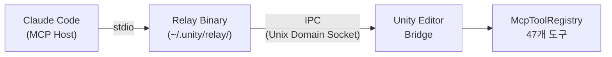
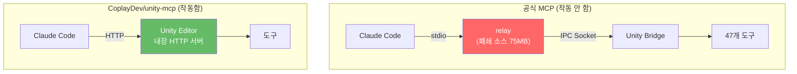

Unity 프로젝트에서 Claude Code를 MCP로 연동해서 쓰고 있었다. [CoplayDev/unity-mcp](https://github.com/CoplayDev/unity-mcp)를 사용했는데, 기능 자체는 잘 되지만 **서버 연결이 자주 끊기는 문제**가 있었다. 작업 중에 갑자기 연결이 끊기면 MCP 서버를 다시 시작해야 하는데, 이게 반복되면 꽤 짜증난다.

그래서 대안을 찾다가 Unity 공식 MCP 패키지(`com.unity.ai.assistant`)를 발견했다. pre-release이긴 한데, 공식이면 좀 더 안정적이지 않을까 싶어서 시도해봤다. 결론부터 말하면 실패했다. Unity 쪽 인프라는 전부 정상이었고 IPC 소켓에 Python으로 직접 붙어서 handshake까지 확인했는데, 정작 **relay binary가 `tools/list`에서 빈 배열을 반환**해서 도구를 하나도 쓸 수 없었다. relay는 75MB짜리 Bun 번들 폐쇄 소스라 내부를 볼 수도 없었다.

꽤 삽질을 많이 해서 기록으로 남겨둔다.

---

## 기존에 쓰던 것: CoplayDev/unity-mcp

[CoplayDev/unity-mcp](https://github.com/CoplayDev/unity-mcp)는 Unity Editor 안에서 직접 HTTP 서버를 돌리는 구조다. relay 같은 중간 프로세스 없이 Claude Code에서 HTTP로 바로 붙는다. 도구도 충분하고 오픈소스다.

잘 작동하긴 하는데, 서버 연결이 자주 끊긴다. Unity Editor가 도메인 리로드를 하거나, 스크립트 컴파일이 돌면 HTTP 서버가 죽는 것 같다. 매번 MCP를 다시 연결해야 하고, 길게 작업하다 보면 세션 중에 끊기는 일이 잦았다.

이게 좀 불편해서, 혹시 공식 패키지는 이 문제를 해결했을까 싶어서 `com.unity.ai.assistant`를 시도해본 것이다.

## Unity 공식 MCP 배경

공식 패키지는 `com.unity.ai.assistant`이고, 2026-03 기준 최신 버전이 `2.2.0-pre.1`이다. 20개 버전 중 마지막인데, 전부 pre-release다.

## 아키텍처가 좀 특이하다

MCP 표준은 **stdio**와 **HTTP** 두 가지 transport를 지원한다. GitHub MCP든 Docker MCP든, 대부분의 MCP 서버는 이 둘 중 하나로 직접 통신한다.

Unity는 사정이 다르다. Unity Editor는 이미 실행 중인 프로세스라서 Claude Code가 직접 시작할 수 없다. 그래서 **relay binary**라는 중간 프로세스를 두고, IPC(Unix Domain Socket)로 Editor에 연결하는 구조를 택했다.



이미 떠있는 프로세스에 붙어야 하니 중간자가 필요하다는 판단은 이해가 간다. 하지만 이 체인에는 장애점이 3개나 있고, 하나만 고장나도 전체가 멈춘다. CoplayDev/unity-mcp 같은 커뮤니티 솔루션은 HTTP 하나로 끝나는데.

## 셋업

공식 문서([Get started with Unity MCP](https://docs.unity3d.com/Packages/com.unity.ai.assistant@2.2/manual/unity-mcp-get-started.html))대로 진행했다.

```bash
# Claude Code에서 MCP 서버 등록
claude mcp add unity-mcp -- \
  ~/.unity/relay/relay_mac_arm64.app/Contents/MacOS/relay_mac_arm64 --mcp
```

Unity 쪽에서는:
1. `Edit → Project Settings → AI → Unity MCP`에서 Bridge가 **Running**인지 확인
2. Pending Connections에서 **Accept** 클릭

문서대로면 여기서 끝이어야 한다. 하지만 여기서부터 문제가 시작됐다.

## relay binary가 없다

Unity 문서에는 Editor 시작 시 relay binary가 `~/.unity/relay/`에 자동 복사된다고 적혀 있다. 실제로는 `relay.json`(149 bytes)만 덩그러니 있고 바이너리가 없었다.

```bash
$ ls ~/.unity/relay/
relay.json  # 이것만 있음
```

[Unity Issue Tracker UUM-136700](https://issuetracker.unity3d.com/issues/gateway-relay-binary-not-copied-to-slash-dot-unity-slash-relay-slash-on-editor-startup-macos)에 보고된 알려진 버그였다 (6000.3.10f1 + ai.assistant 2.0.0-pre.1). 바이너리 원본은 Package Cache 깊숙한 곳에 있었다:

```
Library/PackageCache/com.unity.ai.assistant@df09423d72a0/
  RelayApp~/relay_mac_arm64.app/Contents/MacOS/relay_mac_arm64  (75MB)
```

수동 `cp -R`로 복사해서 넘어갔다. 첫 번째 장벽.

## 승인 대기에서 무한 행

relay를 띄우면 Unity Bridge가 연결 승인을 요구한다. 문제는 승인 전까지 relay가 아무 응답도 안 한다는 것이다. Claude Code MCP에는 timeout이 없어서, 사용자가 Unity Editor로 가서 Accept를 누를 때까지 세션 전체가 멈춘다. 왜 멈췄는지 알려주는 메시지도 없다.

이게 정말로 Unity 쪽 문제인지 확인하고 싶어서 IPC 소켓에 Python으로 직접 연결해봤다:

```python
import socket, json

sock = socket.socket(socket.AF_UNIX, socket.SOCK_STREAM)
sock.connect('/tmp/unity-mcp-aa22b6cd-56655')

msg = json.dumps({
    'jsonrpc': '2.0', 'id': 1, 'method': 'initialize',
    'params': {'protocolVersion': '2024-11-05', 'capabilities': {},
               'clientInfo': {'name': 'test', 'version': '1.0'}}
})
sock.send((msg + '\n').encode())

# 응답:
# {"type":"approval_pending","message":"Connection approval pending user decision"}
```

Unity Editor에서 Accept를 누르면 handshake가 진행된다:

```json
{"type":"handshake","protocol":"unity-mcp","version":"2.0"}
```

이 과정을 미리 알고 있지 않으면 원인을 찾기가 어렵다. Claude Code가 그냥 멈춰버리니까.

덧붙이면, 한번 Revoke하면 해당 클라이언트가 영구 거부된다. `{"type":"approval_denied","reason":"Connection previously denied by user"}` 이런 응답이 오는데, Bridge를 Stop → Start해야 초기화된다. 이것도 문서에 안 나와 있어서 한참 헤맸다.

## `tools: []` — 진짜 문제

위의 장벽들을 전부 넘은 후에도, relay의 `tools/list` 응답이 빈 배열이었다. 이게 핵심 문제다.

relay에 직접 MCP 메시지를 보내서 확인했다:

```bash
(echo '{"jsonrpc":"2.0","id":1,"method":"initialize",...}';
 sleep 2;
 echo '{"jsonrpc":"2.0","method":"notifications/initialized"}';
 sleep 5;
 echo '{"jsonrpc":"2.0","id":2,"method":"tools/list","params":{}}';
 sleep 3) | relay_mac_arm64 --mcp --project-path /path/to/project 2>/dev/null
```

응답:
```json
{"result":{"tools":[]},"jsonrpc":"2.0","id":2}
```

`--project-path`를 추가하면 `Discovery filter: projectPath=..., editorPid=(any)` 로그가 뜨긴 하는데, 결과는 같았다. `tools/call`을 직접 시도해도:

```
"Tool 'Unity_GetConsoleLogs' not found. Available tools: "
```

"Available tools:" 뒤에 빈 문자열이다.

그런데 Unity Editor 내부에서는 도구가 정상 등록되어 있다:

```
# Editor.log
[McpToolRegistry] Registered tool 'Unity_ManageScene'
[McpToolRegistry] Registered tool 'Unity_ManageGameObject'
[McpToolRegistry] Registered tool 'Unity_RunCommand'
... (47개)
```

도구가 Unity 안에는 있는데, relay가 가져오지 못하는 상황이다.

## 인프라 검증 — Unity 쪽은 정상

문제 범위를 좁히기 위해 Unity 쪽 컴포넌트를 하나씩 검증했다.

**Editor & Bridge** — `ps aux`로 PID 확인, Project Settings에서 Bridge Running 확인. Editor.log에서도 정상:

```
MCP Bridge V2 started using Unix Socket at /tmp/unity-mcp-aa22b6cd-56655 (OS=OSXEditor)
Saved connection info to ~/.unity/mcp/connections/bridge-aa22b6cd-56655.json
```

**IPC Socket** — Python으로 직접 연결해서 handshake까지 성공했다. Unity는 소켓을 정상적으로 열고, 승인하고, v2.0 프로토콜로 응답했다.

**Discovery File** — `~/.unity/mcp/connections/bridge-aa22b6cd-56655.json` 내용:

```json
{
  "connection_type": "named_pipe",
  "connection_path": "/tmp/unity-mcp-aa22b6cd-56655",
  "status": "ready",
  "protocol_version": "2.0",
  "editor_pid": 56655
}
```

(참고로 이전 세션들의 stale 파일이 12개나 쌓여 있었다. PID 66095, 56876, 63563 등. 전부 정리하고 현재 세션 것만 남겼는데 결과는 같았다.)

**Tool Registration** — Editor.log에서 47개 도구 등록 확인. **Relay Binary 버전** — Package Cache와 `~/.unity/relay/`의 SHA가 동일(`eefc39db5ea7`). 최신 v1.0.11.

Unity 쪽에서 더 볼 게 없었다.

## relay 프로세스를 뜯어봤다

`lsof`로 relay 프로세스의 네트워크 연결을 추적했더니, 여기서 결정적 차이를 발견했다.

Editor가 자체적으로 띄운 relay(`--relay` 모드):
```
relay_mac 20992  TCP localhost:9001 → localhost:56249 (ESTABLISHED)
```
Unity와 TCP로 연결되어 있다.

Claude Code가 띄운 relay(`--mcp` 모드):
```
relay_mac 48627  unix → stdio (Claude Code)
```
Unity에 대한 TCP 연결도, IPC 연결도 **전혀 없다.** stdio로 Claude Code와만 연결되어 있을 뿐이다.

relay 로그를 보면 같은 패턴이 계속 반복됐다:

```
connection.established
  → (수 초 후)
Relay->Editor communication is blocked
  → Client disconnected
  → Auto-shutdown timer started (180s)
```

연결이 잡히는 듯 하다가 바로 끊긴다. Editor relay의 HTTP endpoint(`localhost:9002/mcp/server-status`)를 찍어봐도:

```bash
$ curl localhost:9002/mcp/server-status -d '{"name":"unity"}'
{"serverName":"unity","isProcessRunning":false}
```

relay 안에서 MCP Server 프로세스 자체가 실행되지 않고 있었다.

## 원인 추정

relay binary가 폐쇄 소스(75MB Bun 번들)라 내부를 직접 볼 수는 없다. 증거를 종합해보면:

**프로토콜 버전 불일치가 가장 유력한 것 같다.** relay metadata에는 `protocolVersion: "1.0"`(unity-ai-relay v1.0.11)이라고 적혀 있고, Bridge는 `protocol: "2.0"`으로 응답한다. handshake 자체는 통과하지만, 도구 목록을 주고받는 프로토콜이 달라서 Claude 측 relay가 Unity에 연결 자체를 못 맺는 것일 수 있다.

타이밍 문제 가능성도 있다. Bridge가 handshake 후 도구 목록을 별도로 push해야 하는 구조인데, relay가 그걸 기다리지 않고 빈 리스트를 바로 반환하는 것일 수도 있다.

결국 `2.2.0-pre.1`은 pre-release다. relay 자동 복사 실패(UUM-136700)도 같은 패키지의 버그다. 아직 production 품질이 아니라고 보는 게 맞다.

## Claude Code MCP 구현도 문제가 있다

Unity MCP만의 문제는 아니다.

**MCP tool call에 timeout이 없다.** [Issue #15945](https://github.com/anthropics/claude-code/issues/15945)에 16시간 넘게 행이 걸린 사례가 보고돼 있고, [#17662](https://github.com/anthropics/claude-code/issues/17662)에서는 `MCP_TOOL_TIMEOUT` 환경변수를 설정해도 무시된다고 한다. timeout이 있었다면 무한 행 대신 에러 메시지를 받고 다른 방법을 시도할 수 있었을 것이다.

**`claude mcp list`가 "Connected"라고 보고하지만, 이건 relay 프로세스가 시작됐다는 것만 확인할 뿐이다.** 실제로 도구가 하나라도 있는지는 체크하지 않는다. "Connected" 보고 정상이라고 믿었다가 시간을 꽤 낭비했다.

## 시도한 것들

| # | 시도 | 결과 |
|---|------|------|
| 1 | 공식 가이드대로 `--mcp` only | tools: [] |
| 2 | `--mcp --project-path` 추가 | Discovery filter 작동, tools: [] |
| 3 | Stale discovery 파일 12개 정리 | 변화 없음 |
| 4 | Unity Bridge Stop → Start | 변화 없음 |
| 5 | 좀비 프로세스 전부 kill 후 재시작 | 변화 없음 |
| 6 | IPC 소켓 직접 연결 테스트 | handshake 성공 (Unity 정상 확인) |
| 7 | 연결 Revoke → 재승인 | approval_denied → 재승인 → tools: [] |
| 8 | Claude Code 재시작 5회+ | 매번 Connected, 매번 도구 0개 |
| 9 | Auto Refresh 비활성화 | 변화 없음 |
| 10 | Domain Reload 비활성화 | 이미 설정됨, 변화 없음 |

10가지를 시도했고 전부 실패했다. 6번에서 IPC 직접 연결로 Unity가 정상임을 확인한 시점에서, 문제는 relay binary 내부에 있다고 확신했다. 폐쇄 소스라 더 이상 파고들 수가 없었다.

## 비교: CoplayDev/unity-mcp vs 공식 MCP



CoplayDev/unity-mcp는 HTTP 하나로 끝나는 단순한 구조다. 공식은 relay라는 중간 프로세스가 끼어있어서 장애점이 늘어난다. CoplayDev 쪽이 연결 끊김 문제가 있긴 하지만, 최소한 도구는 동작한다. 공식은 도구 자체가 안 잡힌다.

## 결론

공식 MCP의 relay 아키텍처가 문제였다. stdio → relay → IPC → Bridge, 이 4단계 체인에서 relay가 Unity에 연결 자체를 못 맺고 있었고, relay가 폐쇄 소스라 원인을 더 이상 추적할 수 없었다.

결국 CoplayDev/unity-mcp로 돌아왔다. 연결 끊김 이슈는 여전히 있지만, 도구가 아예 안 잡히는 것보다는 낫다. 공식 패키지가 안정화되면 다시 시도해볼 생각이다. pre-release는 pre-release니까.

Claude Code MCP 쪽도 timeout 부재와 "Connected" 상태 보고의 문제가 있었다. MCP 서버 하나가 응답을 안 하면 세션 전체가 죽는 건 좀 위험하다.

## 재현 환경

- macOS Sequoia (Apple Silicon M1 Pro 16GB)
- Unity 6000.3.11f1
- `com.unity.ai.assistant@2.2.0-pre.1`
- relay: `unity-ai-relay v1.0.11`, SHA `eefc39db5ea7`
- Bridge protocol: v2.0
- Claude Code v2.1.x (Opus 4.6)

---

*이 분석은 Claude Code(Opus 4.6)와 함께 수행했다. IPC 소켓 직접 연결 테스트, `lsof`로 relay 프로세스 추적, Editor.log 분석, Unity Issue Tracker 조사를 포함한다. 내 환경에서만 재현되는 문제일 수 있으니, 같은 환경에서 시도해본 분은 경험을 공유해주시면 좋겠다.*
